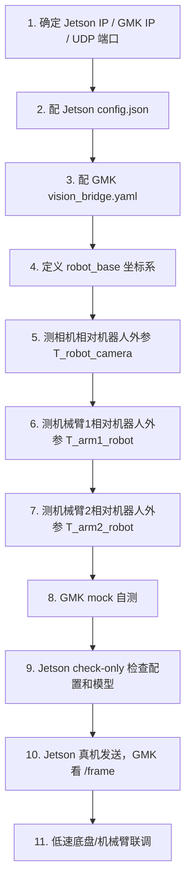
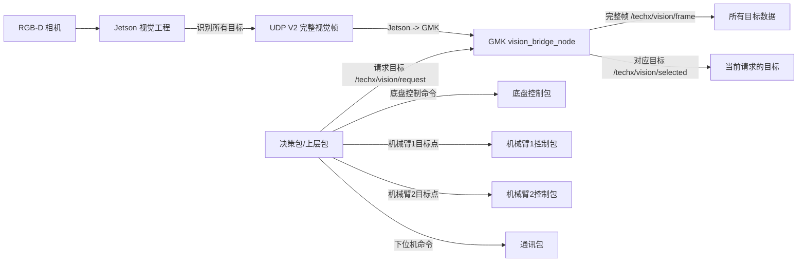
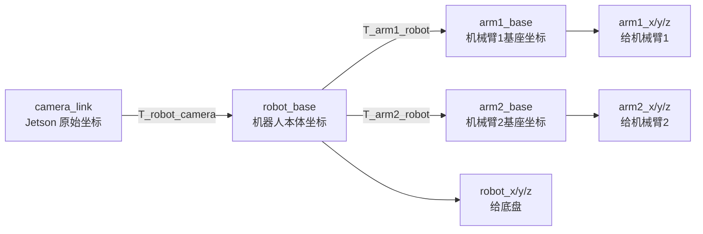

# techx_vision_bridge 使用说明书

这份文档只讲 GMK 仓库里的 `techx_vision_bridge` 包怎么用。它面向第一次接触这个工程的人。

先记住一句话：

```text
Jetson 会实时发送它看到的所有目标。
GMK 的 vision_bridge_node 会实时接收完整视觉帧。
上层包想要哪个目标，就向 /techx/vision/request 发请求。
GMK 会从最新完整帧里筛出对应目标，发布到 /techx/vision/selected。
```

这个包不是底盘控制包，不是机械臂控制包，也不是决策状态机。它的作用是：

```text
Jetson 视觉数据  ->  GMK ROS2 话题  ->  决策/底盘/机械臂能使用的坐标数据
```

---

# 0. 新人 10 分钟跑通 mock 流程

这一节不需要真实 Jetson、不需要相机、不需要机械臂。目的只是确认 GMK 包自己能跑通。

## 0.1 编译

```bash
cd ~/gmk_ws
rm -rf build install log
colcon build --packages-select techx_vision_bridge
source install/setup.bash
```

如果这一步失败，先不要接 Jetson，也不要接机械臂。

## 0.2 启动 GMK 视觉桥

```bash
ros2 launch techx_vision_bridge vision_bridge.launch.py
```

这个命令只启动一个节点：

```text
vision_bridge_node
```

这个节点同时做四件事：

```text
1. 接收 Jetson UDP V2
2. 发布 /techx/vision/frame
3. 接收 /techx/vision/request
4. 发布 /techx/vision/selected
```

## 0.3 用假 Jetson 发送数据

新开一个终端：

```bash
source ~/gmk_ws/install/setup.bash
ros2 run techx_vision_bridge mock_jetson_sender.py --mode mixed --ip 127.0.0.1
```

## 0.4 看完整视觉数据

新开一个终端：

```bash
source ~/gmk_ws/install/setup.bash
ros2 topic echo /techx/vision/frame
```

如果能看到 `targets[]`、`class_id`、`robot_x/y/z`、`arm1_x/y/z`、`arm2_x/y/z`，说明 GMK 收数据正常。

## 0.5 请求一个目标

请求二维码：

```bash
ros2 run techx_vision_bridge vision_request_demo.py --name qr
```

请求拳头武器头：

```bash
ros2 run techx_vision_bridge vision_request_demo.py --name head_fist
```

请求红方 R2 真 KFS：

```bash
ros2 run techx_vision_bridge vision_request_demo.py --name kfs_red_r2_true
```

如果 demo 输出：

```text
status = OK
has_match = true
class_id = 你请求的目标编号
```

说明 `/request -> /selected` 流程正常。

---

# 1. 真实上车前要配置哪些东西

真实上车前，不要直接跑。先按这个顺序配置：



## 1.1 配置清单

| 类别 | 配置项 | 写在哪里 | 为什么要填 |
|---|---|---|---|
| 网络 | GMK IP | Jetson `config.json` 的 `udp.target_ip` | Jetson 要知道把数据发给谁 |
| 网络 | UDP 端口 | Jetson `config.json` 和 GMK `vision_bridge.yaml` | 两边端口必须一致 |
| 相机 | 图像宽高、内参 | Jetson `config.json` | Jetson 用它算 `camera_link` 坐标 |
| 模型 | KFS/武器头模型路径 | Jetson `config.json` | Jetson 要加载模型 |
| 目标编号 | `class_id_map` | Jetson `config.json` | 保证目标编号和 GMK 一致 |
| 机器人 | `robot_base` 坐标定义 | 机械/控制约定 | 底盘控制要统一方向 |
| 相机外参 | `T_robot_camera_xyz_rpy` | GMK `vision_bridge.yaml` | 把相机坐标转成机器人坐标 |
| 机械臂1外参 | `T_arm1_robot_xyz_rpy` | GMK `vision_bridge.yaml` | 把机器人坐标转成机械臂1坐标 |
| 机械臂2外参 | `T_arm2_robot_xyz_rpy` | GMK `vision_bridge.yaml` | 把机器人坐标转成机械臂2坐标 |

## 1.2 推荐网络例子

假设：

```text
Jetson IP = 192.168.10.10
GMK IP    = 192.168.10.100
UDP 端口  = 12345
```

Jetson `config.json` 里应该写：

```json
"udp": {
  "target_ip": "192.168.10.100",
  "target_port": 12345
}
```

GMK `vision_bridge.yaml` 里应该写：

```yaml
udp_bind_addr: "0.0.0.0"
udp_port: 12345
```

注意：

```text
Jetson 的 target_ip 填 GMK 的 IP，不是 Jetson 自己的 IP。
GMK 的 udp_port 必须和 Jetson 的 target_port 一样。
```

---

# 2. 整个工程的数据流

## 2.1 总体图



## 2.2 最重要的理解

Jetson 是全量发送。

如果 Jetson 同一帧看到：

```text
拳头武器头 class_id = 100
红方 R2 真 KFS class_id = 2
二维码 class_id = 200
```

它会一起发送：

```text
UDP V2:
  count = 3
  target[0] = class_id 100
  target[1] = class_id 2
  target[2] = class_id 200
```

GMK 是完整接收。

```text
/techx/vision/frame:
  targets[0] = class_id 100
  targets[1] = class_id 2
  targets[2] = class_id 200
```

上层包按需请求。

```text
/request: class_id = 100  ->  /selected 输出拳头武器头
/request: class_id = 2    ->  /selected 输出红方 R2 真 KFS
/request: class_id = 200  ->  /selected 输出二维码
```

注意：

```text
/request 不会命令 Jetson 改模型。
/request 只影响 GMK 输出哪个 selected。
/frame 永远是完整帧。
```

---

# 3. 本包接收什么、发布什么

## 3.1 输入

| 输入 | 类型 | 来源 | 作用 |
|---|---|---|---|
| UDP V2 | 自定义 UDP 包 | Jetson | Jetson 发来的所有识别目标 |
| `/techx/vision/request` | `VisionRequest` | 决策包/上层包 | 请求 GMK 输出某个目标 |

## 3.2 输出

| 输出 | 类型 | 给谁用 | 作用 |
|---|---|---|---|
| `/techx/vision/frame` | `VisionFrame` | 决策、调试、日志 | 一帧完整视觉数据，包含所有目标 |
| `/techx/vision/objects` | `VisionObject` | 调试 | 单目标流，可不用 |
| `/techx/vision/selected` | `VisionSelection` | 决策、底盘、机械臂上层逻辑 | 根据 request 筛选出的目标 |

## 3.3 三个 ROS2 话题怎么选

| 你想干什么 | 看哪个话题 |
|---|---|
| 看 Jetson 到底发来了什么 | `/techx/vision/frame` |
| 想要某一个目标 | 发 `/techx/vision/request`，看 `/techx/vision/selected` |
| 调试每个目标单独输出 | `/techx/vision/objects` |

---

# 4. 坐标系和坐标转换链路

这是最容易用错的地方。先看整体转换链路：



## 4.1 四个坐标系分别是什么

| 坐标系 | 字段 | 谁产生 | 谁使用 | 含义 |
|---|---|---|---|---|
| `camera_link` | `x/y/z` | Jetson | 调试、标定 | 相机坐标，原始 3D 点 |
| `robot_base` | `robot_x/y/z` | GMK | 底盘、导航、决策 | 目标相对机器人本体的位置 |
| `arm1_base` | `arm1_x/y/z` | GMK | 机械臂1 | 目标相对机械臂1基座的位置 |
| `arm2_base` | `arm2_x/y/z` | GMK | 机械臂2 | 目标相对机械臂2基座的位置 |

建议约定：

```text
robot_base:
  X：机器人前方
  Y：机器人左方
  Z：机器人上方
```

那么：

```text
robot_x：目标在机器人前方/后方的位置
robot_y：目标在机器人左边/右边的位置
robot_z：目标高度
```

底盘前后、左右、旋转对准，一律优先用 `robot_x/y/z` 或 `align_err_x/y`。

## 4.2 GMK 具体做了哪些转换

GMK 收到 Jetson 的 `camera_link` 坐标后，会做：

```text
p_robot = T_robot_camera * p_camera
p_arm1  = T_arm1_robot  * p_robot
p_arm2  = T_arm2_robot  * p_robot
```

所以同一个目标会同时拥有：

```text
x/y/z             camera_link 坐标
robot_x/y/z       robot_base 坐标
arm1_x/y/z        arm1_base 坐标
arm2_x/y/z        arm2_base 坐标
```

这意味着：

```text
武器头不是只输出 arm1 坐标，它同时也输出 robot 坐标。
KFS 不是只输出 arm2 坐标，它同时也输出 robot 坐标。
```

---

# 5. 推荐控制坐标 control_frame / control_x/y/z 到底是什么

这一节非常重要。

`control_x/y/z` **不是一种新的神秘坐标系**。

它只是 GMK 根据目标类型，从已经算好的三套坐标中选出一套，复制到 `control_x/y/z`，方便简单控制使用。

真正决定 `control_x/y/z` 属于哪个坐标系的是：

```text
control_frame
```

## 5.1 control_frame 数值含义

| `control_frame` | 坐标系 | `control_x/y/z` 实际等于什么 | 通常给谁用 |
|---:|---|---|---|
| 1 | `camera_link` | `x/y/z` | 一般不用，只做调试 |
| 2 | `robot_base` | `robot_x/y/z` | 底盘、二维码、导航 |
| 3 | `arm1_base` | `arm1_x/y/z` | 机械臂1，武器头 |
| 4 | `arm2_base` | `arm2_x/y/z` | 机械臂2，KFS |

也就是说：

```text
如果 control_frame = 2：
  control_x/y/z 就是 robot_x/y/z

如果 control_frame = 3：
  control_x/y/z 就是 arm1_x/y/z

如果 control_frame = 4：
  control_x/y/z 就是 arm2_x/y/z
```

## 5.2 当前默认规则

GMK 的 `class_rules` 默认是：

```yaml
class_rules:
  - "0-5:2:2:4:0.0"       # KFS -> control_frame = 4 = arm2_base
  - "100-102:1:1:3:0.0"   # 武器头 -> control_frame = 3 = arm1_base
  - "200:3:3:2:0.0"       # 二维码 -> control_frame = 2 = robot_base
```

所以默认情况下：

| 目标 | `class_id` | `control_frame` | `control_x/y/z` 实际坐标 |
|---|---:|---:|---|
| KFS | 0~5 | 4 | `arm2_x/y/z` |
| 武器头 | 100~102 | 3 | `arm1_x/y/z` |
| 二维码 | 200 | 2 | `robot_x/y/z` |

## 5.3 为什么还要保留 robot_x/y/z、arm1_x/y/z、arm2_x/y/z

因为不同模块需要同一个目标的不同坐标。

以武器头为例：

```text
武器头 class_id=100
  robot_x/y/z   给底盘靠近和对准
  arm1_x/y/z    给机械臂1抓取
  arm2_x/y/z    一般不用，但也会计算出来
  control_x/y/z 默认等于 arm1_x/y/z
```

以 KFS 为例：

```text
KFS class_id=2
  robot_x/y/z   给底盘靠近和对准
  arm1_x/y/z    一般不用，但也会计算出来
  arm2_x/y/z    给机械臂2操作
  control_x/y/z 默认等于 arm2_x/y/z
```

## 5.4 正式控制时建议怎么用

正式控制不要盲目只用 `control_x/y/z`。

推荐规则：

| 控制对象 | 应该使用 | 不要偷懒用 |
|---|---|---|
| 底盘 | `robot_x/y/z`、`align_err_x/y` | 不要用武器头/KFS 的 `control_x/y/z` 控底盘 |
| 机械臂1 | `arm1_x/y/z` | 不要用 `robot_x/y/z` 直接给机械臂1 |
| 机械臂2 | `arm2_x/y/z` | 不要用 `robot_x/y/z` 直接给机械臂2 |
| 简单演示 | 可以用 `control_x/y/z`，但必须先看 `control_frame` | 不看 `control_frame` 直接用 |

最容易犯的错误：

```text
看到武器头 selected.target.control_x/y/z，就拿去控制底盘。
这是错的。
武器头的 control_x/y/z 默认是 arm1_base 坐标。
底盘应该用 selected.target.robot_x/y/z。
```

```text
看到 KFS selected.target.control_x/y/z，就拿去控制底盘。
这也是错的。
KFS 的 control_x/y/z 默认是 arm2_base 坐标。
底盘应该用 selected.target.robot_x/y/z。
```

---

# 6. 目标数据到底有哪些

每一个目标在 ROS2 里叫 `VisionObject`。

它会出现在：

```text
/techx/vision/frame.targets[]
/techx/vision/objects
/techx/vision/selected.target
```

## 6.1 比赛真正关心的字段

| 你想知道什么 | 字段 | 说明 |
|---|---|---|
| 这是什么物体 | `class_id` | 100拳头，2红方真 KFS，200二维码等 |
| 是哪一类目标 | `target_type` | 1武器头，2KFS，3二维码 |
| 识别可信不可信 | `confidence` | 太低不要控制 |
| 底盘怎么靠近 | `robot_x/y/z` | 目标在机器人本体坐标下的位置 |
| 机械臂1怎么抓 | `arm1_x/y/z` | 目标在机械臂1基座下的位置 |
| 机械臂2怎么抓 | `arm2_x/y/z` | 目标在机械臂2基座下的位置 |
| 推荐坐标是哪套 | `control_frame` | 2=robot，3=arm1，4=arm2 |
| 推荐坐标数值 | `control_x/y/z` | 等于 `control_frame` 指向的那套坐标 |
| 坐标能不能用 | `valid_robot_xyz / valid_arm1_xyz / valid_arm2_xyz / valid_control_xyz` | 防止无深度或坐标无效 |
| 数据新不新 | `/selected.frame_age_sec` | 旧数据不能控制 |
| 当前能不能控制 | `/selected.status` | 必须 OK 才能继续 |

## 6.2 目标身份字段

| 字段 | 含义 | 例子 |
|---|---|---|
| `class_id` | 具体物体编号 | 100拳头，2红方 R2 真 KFS，200二维码 |
| `target_type` | 目标大类 | 1武器头，2KFS，3二维码 |
| `zone_id` | 区域编号 | 1武器头，2KFS，3二维码 |
| `color` | 颜色 | 0未知，1红，2蓝 |
| `confidence` | 置信度 | 0.0~1.0 |

## 6.3 像素字段

| 字段 | 含义 | 用途 |
|---|---|---|
| `u` | 图像中心 x 像素 | 显示、调试 |
| `v` | 图像中心 y 像素 | 显示、调试 |
| `align_err_x` | 相对图像中心横向误差 | 底盘旋转/图像居中 |
| `align_err_y` | 相对图像中心纵向误差 | 调试或垂直对齐 |

`align_err_x/y` 不是米，是归一化图像误差。

## 6.4 坐标字段

| 坐标 | 字段 | 谁用 | 说明 |
|---|---|---|---|
| 相机坐标 | `x/y/z` | 调试 | Jetson 原始 `camera_link` 坐标 |
| 机器人坐标 | `robot_x/y/z` | 底盘/导航 | 目标相对机器人本体的位置 |
| 机械臂1坐标 | `arm1_x/y/z` | 机械臂1 | 目标相对机械臂1基座的位置 |
| 机械臂2坐标 | `arm2_x/y/z` | 机械臂2 | 目标相对机械臂2基座的位置 |
| 推荐坐标 | `control_x/y/z` | 简单控制 | 等于 `control_frame` 指向的那一套坐标 |

---

# 7. 武器头、KFS、二维码分别怎么用

## 7.1 武器头

| class_id | 目标 |
|---:|---|
| 100 | 拳头武器头 |
| 101 | 掌武器头 |
| 102 | 矛头武器头 |

使用方式：

| 使用对象 | 使用字段 | 用途 |
|---|---|---|
| 底盘 | `robot_x/y/z` | 前后靠近、左右调整、转向对准 |
| 机械臂1 | `arm1_x/y/z` | 抓取、对接武器头 |

重点：

```text
武器头不是只给机械臂1。
武器头同时也输出 robot_x/y/z 给底盘。
武器头的 control_frame 默认是 3，control_x/y/z 默认等于 arm1_x/y/z。
所以底盘不要用 control_x/y/z，底盘要用 robot_x/y/z。
```

## 7.2 KFS

| class_id | 目标 |
|---:|---|
| 0 | 红方 R1 KFS |
| 1 | 红方 R2 假 KFS |
| 2 | 红方 R2 真 KFS |
| 3 | 蓝方 R1 KFS |
| 4 | 蓝方 R2 假 KFS |
| 5 | 蓝方 R2 真 KFS |

使用方式：

| 使用对象 | 使用字段 | 用途 |
|---|---|---|
| 底盘 | `robot_x/y/z` | 前后靠近、左右调整、转向对准 |
| 机械臂2 | `arm2_x/y/z` | 操作 KFS |

重点：

```text
KFS 不是只给机械臂2。
KFS 同时也输出 robot_x/y/z 给底盘。
KFS 的 control_frame 默认是 4，control_x/y/z 默认等于 arm2_x/y/z。
所以底盘不要用 control_x/y/z，底盘要用 robot_x/y/z。
```

## 7.3 二维码

| class_id | 目标 |
|---:|---|
| 200 | 二维码 |

使用方式：

| 使用对象 | 使用字段 | 用途 |
|---|---|---|
| 底盘 | `align_err_x/y` | 图像居中、旋转对准 |
| 底盘 | `robot_x/y/z` | 靠近、距离控制 |

二维码默认：

```text
control_frame = 2
control_x/y/z = robot_x/y/z
```

---

# 8. 怎么向 GMK 请求目标

## 8.1 最简单方式：用 demo

```bash
ros2 run techx_vision_bridge vision_request_demo.py --name qr
ros2 run techx_vision_bridge vision_request_demo.py --name head_fist
ros2 run techx_vision_bridge vision_request_demo.py --name kfs_red_r2_true
ros2 run techx_vision_bridge vision_request_demo.py --name kfs_blue_r2_true
```

## 8.2 手动发布 request

请求二维码：

```bash
ros2 topic pub --once /techx/vision/request techx_vision_bridge/msg/VisionRequest "{
  request_seq: 1,
  target_type: 3,
  zone_id: 3,
  use_class_id: true,
  class_id: 200,
  use_color: false,
  require_control_xyz: false,
  min_confidence: 0.3,
  max_frame_age_sec: 0.2
}"
```

请求拳头武器头：

```bash
ros2 topic pub --once /techx/vision/request techx_vision_bridge/msg/VisionRequest "{
  request_seq: 2,
  target_type: 1,
  zone_id: 1,
  use_class_id: true,
  class_id: 100,
  use_color: false,
  require_control_xyz: true,
  min_confidence: 0.4,
  max_frame_age_sec: 0.2
}"
```

请求红方 R2 真 KFS：

```bash
ros2 topic pub --once /techx/vision/request techx_vision_bridge/msg/VisionRequest "{
  request_seq: 3,
  target_type: 2,
  zone_id: 2,
  use_class_id: true,
  class_id: 2,
  use_color: false,
  require_control_xyz: true,
  min_confidence: 0.4,
  max_frame_age_sec: 0.2
}"
```

## 8.3 request 每个字段是什么意思

| 字段 | 含义 | 推荐 |
|---|---|---|
| `request_seq` | 请求编号 | 每次递增 |
| `target_type` | 目标大类 | 武器头=1，KFS=2，QR=3 |
| `zone_id` | 目标区域 | 武器头=1，KFS=2，QR=3 |
| `use_class_id` | 是否精确筛 class_id | 推荐 true |
| `class_id` | 具体目标编号 | 100/101/102/0~5/200 |
| `use_color` | 是否筛颜色 | 通常 false |
| `require_control_xyz` | 是否要求三维推荐坐标有效 | 抓取/靠近建议 true |
| `min_confidence` | 最低置信度 | 0.3~0.5 |
| `max_frame_age_sec` | 允许使用多旧的 frame | 建议 0.2 |

---

# 9. `/selected` 怎么判断能不能用

看：

```bash
ros2 topic echo /techx/vision/selected
```

`status` 含义：

| status | 名称 | 含义 | 能不能控制 |
|---:|---|---|---|
| 0 | `STATUS_OK` | 找到目标 | 可以继续检查坐标有效性 |
| 1 | `STATUS_NO_REQUEST` | 没有收到 request | 不要控制 |
| 2 | `STATUS_NO_FRAME` | 没有收到 Jetson frame | 不要控制 |
| 3 | `STATUS_NO_MATCH` | 没有符合 request 的目标 | 不要控制 |
| 4 | `STATUS_FRAME_STALE` | 最新 frame 太旧 | 不要控制 |
| 5 | `STATUS_REQUEST_STALE` | request 太旧 | 不要控制 |

控制前必须检查：

```text
selected.status == 0
selected.has_match == true
selected.frame_age_sec < 0.2 左右
selected.target.confidence >= 阈值
```

底盘控制前：

```text
selected.target.valid_robot_xyz == true
```

机械臂1控制前：

```text
selected.target.valid_arm1_xyz == true
```

机械臂2控制前：

```text
selected.target.valid_arm2_xyz == true
```

如果直接使用推荐坐标，还必须检查：

```text
selected.target.valid_control_xyz == true
并且看清楚 selected.target.control_frame 是 2、3 还是 4
```

---

# 10. vision_bridge.yaml 每个重要参数

配置文件路径：

```text
src/techx_vision_bridge/config/vision_bridge.yaml
```

## 10.1 UDP 接收

```yaml
udp_bind_addr: "0.0.0.0"
udp_port: 12345
```

| 参数 | 含义 |
|---|---|
| `udp_bind_addr` | GMK 监听哪个本地地址，通常用 `0.0.0.0` |
| `udp_port` | GMK 接收 Jetson UDP 的端口 |

## 10.2 话题名

```yaml
frame_topic_name: "/techx/vision/frame"
object_topic_name: "/techx/vision/objects"
request_topic_name: "/techx/vision/request"
selected_topic_name: "/techx/vision/selected"
```

## 10.3 class_rules

```yaml
class_rules:
  - "0-5:2:2:4:0.0"
  - "100-102:1:1:3:0.0"
  - "200:3:3:2:0.0"
```

格式：

```text
"class_or_range:zone_id:target_type:control_frame:priority_bias"
```

当前默认：

| class_id | 目标 | zone_id | target_type | control_frame |
|---|---|---:|---:|---:|
| 0~5 | KFS | 2 | 2 | 4 arm2_base |
| 100~102 | 武器头 | 1 | 1 | 3 arm1_base |
| 200 | 二维码 | 3 | 3 | 2 robot_base |

## 10.4 外参

```yaml
T_robot_camera_xyz_rpy: [x, y, z, roll, pitch, yaw]
T_arm1_robot_xyz_rpy:  [x, y, z, roll, pitch, yaw]
T_arm2_robot_xyz_rpy:  [x, y, z, roll, pitch, yaw]
```

单位：

```text
x/y/z：米
roll/pitch/yaw：弧度
```

方向：

```text
T_robot_camera：把 camera_link 点转到 robot_base
T_arm1_robot： 把 robot_base 点转到 arm1_base
T_arm2_robot： 把 robot_base 点转到 arm2_base
```

如果外参没标定，`robot_x/y/z`、`arm1_x/y/z`、`arm2_x/y/z` 不能用于真实控制。

## 10.5 超时保护

```yaml
watchdog_timeout_sec: 0.3
fatal_no_udp_timeout_sec: 600.0
```

| 参数 | 含义 |
|---|---|
| `watchdog_timeout_sec` | 短时间没收到 UDP 时报警 |
| `fatal_no_udp_timeout_sec` | 长时间没收到 UDP 时自动退出，默认 10 分钟 |

---

# 11. 完整真实联调流程

## 11.1 GMK 先 mock 自测

```bash
cd ~/gmk_ws
rm -rf build install log
colcon build --packages-select techx_vision_bridge
source install/setup.bash

ros2 launch techx_vision_bridge vision_bridge.launch.py
```

另一个终端：

```bash
source ~/gmk_ws/install/setup.bash
ros2 run techx_vision_bridge mock_jetson_sender.py --mode mixed --ip 127.0.0.1
```

看：

```bash
ros2 topic echo /techx/vision/frame
```

请求：

```bash
ros2 run techx_vision_bridge vision_request_demo.py --name qr
ros2 run techx_vision_bridge vision_request_demo.py --name head_fist
ros2 run techx_vision_bridge vision_request_demo.py --name kfs_red_r2_true
```

## 11.2 Jetson 检查配置

在 Jetson 上：

```bash
python3 launch.py --check-only --config config.json
```

确认：

```text
config.json 存在
UDP target_ip 是 GMK IP
target_port 是 GMK 监听端口
models/kfs_v3 有模型
models/head_v1 有模型
class_id_map 没冲突
QR class_id 是 200
```

## 11.3 Jetson 真机发送

Jetson：

```bash
./start_jetson.sh
```

GMK 上看：

```bash
ros2 topic hz /techx/vision/frame
ros2 topic echo /techx/vision/frame
```

只要 `/frame` 有频率，说明 Jetson -> GMK 通了。

## 11.4 低速控制验证

先不要真实抓取。按顺序：

```text
1. 只看 /frame，不控制
2. 看 robot_x/y/z 方向是否正确
3. 看 arm1_x/y/z、arm2_x/y/z 是否合理
4. 低速底盘靠近
5. 机械臂空动作到目标附近
6. 最后才尝试抓取/对接
```

---

# 12. 成功现象和失败排查

| 现象 | 说明 | 处理 |
|---|---|---|
| `/frame` 有频率 | Jetson -> GMK 通了 | 继续看 targets |
| `/frame.target_count = 0` | 链路在线，但当前没目标 | 检查画面、模型、目标位置 |
| `/selected.status = 0` | 找到 request 对应目标 | 检查坐标有效性后控制 |
| `/selected.status = 2` | 没有 frame | 检查 Jetson、IP、端口、防火墙 |
| `/selected.status = 3` | 没有匹配目标 | 检查 class_id、target_type、置信度 |
| `/selected.status = 4` | frame 太旧 | 检查 Jetson 是否停止发送 |
| `valid_robot_xyz = false` | robot 坐标不可用 | 检查深度、外参、z 是否有效 |
| 坐标方向反了 | 外参或坐标轴定义错 | 检查 robot_base 和 T_robot_camera |
| 底盘用 control 后乱动 | 用错坐标系 | 底盘必须用 robot_x/y/z |

---

# 13. 最后牢记

```text
Jetson 输出 camera_link。
GMK 转成 robot_base、arm1_base、arm2_base。

武器头：
  底盘用 robot_x/y/z。
  机械臂1用 arm1_x/y/z。
  control_x/y/z 默认是 arm1_x/y/z。

KFS：
  底盘用 robot_x/y/z。
  机械臂2用 arm2_x/y/z。
  control_x/y/z 默认是 arm2_x/y/z。

二维码：
  底盘用 robot_x/y/z 和 align_err_x/y。
  control_x/y/z 默认是 robot_x/y/z。

control_x/y/z 必须结合 control_frame 看。
不看 control_frame 直接用 control_x/y/z 是错误用法。
```
