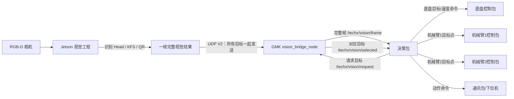
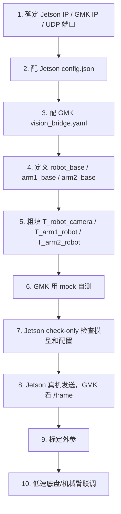
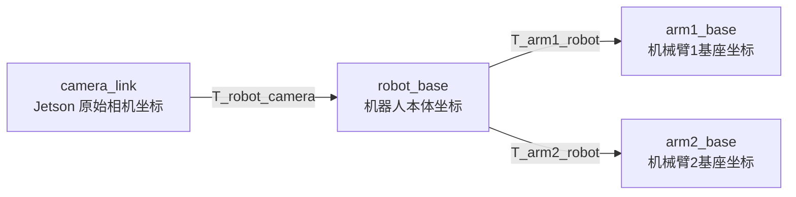

# techx_vision_bridge：GMK 端视觉数据桥接包使用手册

这份文档面向第一次接触工程的人。

读完后你应该知道：

```text
1. 这个包在整车工程里负责什么。
2. 拿到工程后先配置哪些参数。
3. Jetson 发来的数据是什么。
4. GMK 会发布哪些 ROS2 话题。
5. 决策包应该怎么请求目标。
6. 底盘、机械臂1、机械臂2分别应该使用哪些坐标。
7. 出问题时应该先看哪里。
```

---

## 0. 最核心的一句话

```text
Jetson 实时发送它识别到的所有目标。
GMK 的 vision_bridge_node 实时接收完整视觉帧。
上层包想要某个目标时，向 /techx/vision/request 发请求。
GMK 从最新完整帧里筛出对应目标，发布到 /techx/vision/selected。
```

所以本包不是机械臂控制包，也不是底盘控制包。它是：

```text
Jetson 视觉数据 -> GMK ROS2 数据 -> 决策/底盘/机械臂可用坐标
```

---

## 1. 当前工程结构

当前 GMK 视觉包只有一个运行节点：

```text
/vision_bridge_node
```

启动命令：

```bash
ros2 launch techx_vision_bridge vision_bridge.launch.py
```

这个节点内部同时完成：

```text
1. 接收 Jetson UDP V2。
2. 校验 magic / version / packet length / CRC / seq。
3. 解码目标 class_id / confidence / u / v / camera_link x/y/z。
4. 根据 class_rules 判断目标是什么。
5. 把 camera_link 坐标转换成 robot_base、arm1_base、arm2_base。
6. 发布完整视觉帧 /techx/vision/frame。
7. 接收上层请求 /techx/vision/request。
8. 发布请求结果 /techx/vision/selected。
9. 短时间无数据时输出 stale 状态，长时间无数据时自动 shutdown。
```

不需要再启动第二个 selector 节点。

---

## 2. 整车数据流图

### 2.1 总体数据流



### 2.2 每条线是什么意思

| 数据流 | 方向 | 含义 |
|---|---|---|
| UDP V2 | Jetson -> GMK | Jetson 把同一帧中所有识别目标发给 GMK |
| `/techx/vision/frame` | GMK -> 决策/调试 | 完整视觉帧，所有目标都在里面 |
| `/techx/vision/request` | 决策/上层 -> GMK | 告诉 GMK 当前想要哪一个目标 |
| `/techx/vision/selected` | GMK -> 决策/上层 | GMK 从最新 frame 中筛出的目标 |
| 底盘/机械臂命令 | 决策 -> 控制包 | 不是本包负责，本包只提供视觉数据和坐标 |

---

## 3. 拿到工程后先配置什么

不要一上来就运行。正确顺序是：



### 3.1 Jetson 端主要配置

Jetson 仓库的 `config.json` 负责：

| 配置项 | 在哪里 | 含义 |
|---|---|---|
| `udp.target_ip` | Jetson `config.json` | GMK 的 IP，不是 Jetson 自己的 IP |
| `udp.target_port` | Jetson `config.json` | GMK 接收 UDP 的端口 |
| `models[].folder` | Jetson `config.json` | 模型文件夹，例如 `kfs_v3`、`head_v1` |
| `models[].class_id_map` | Jetson `config.json` | 把模型本地类别映射成比赛全局 class_id |
| `qr.class_id` | Jetson `config.json` | 二维码 class_id，当前 200 |
| `camera.width/height/fx/fy/cx/cy` | Jetson `config.json` | 相机图像尺寸和内参，用于算 camera_link x/y/z |

Jetson 默认把数据发给：

```json
"udp": {
  "target_ip": "192.168.10.100",
  "target_port": 12345
}
```

这里的 `target_ip` 应该填 **GMK 的 IP**。

### 3.2 GMK 端主要配置

GMK 仓库的配置文件路径：

```text
src/techx_vision_bridge/config/vision_bridge.yaml
```

它负责：

| 配置项 | 含义 |
|---|---|
| `udp_bind_addr` | GMK 监听哪个本机网口，通常先用 `0.0.0.0` |
| `udp_port` | GMK 接收 Jetson UDP 的端口，必须等于 Jetson `target_port` |
| `frame_topic_name` | 完整视觉帧话题，默认 `/techx/vision/frame` |
| `request_topic_name` | 请求目标的话题，默认 `/techx/vision/request` |
| `selected_topic_name` | 筛选目标输出话题，默认 `/techx/vision/selected` |
| `image_width/image_height` | 用于计算 `align_err_x/y`，应和 Jetson 图像尺寸一致 |
| `class_rules` | class_id 到目标类型、推荐坐标系的映射 |
| `T_robot_camera_xyz_rpy` | 相机到机器人本体的外参 |
| `T_arm1_robot_xyz_rpy` | 机器人本体到机械臂1基座的外参 |
| `T_arm2_robot_xyz_rpy` | 机器人本体到机械臂2基座的外参 |
| `watchdog_timeout_sec` | 短时间无 UDP 的 warning/stale 超时 |
| `fatal_no_udp_timeout_sec` | 长时间无 UDP 自动 shutdown 超时 |

默认 UDP 接收配置：

```yaml
udp_bind_addr: "0.0.0.0"
udp_port: 12345
```

这表示 GMK 在本机所有网口监听 `12345`。

---

## 4. 坐标系必须先说清楚

本工程涉及 4 个坐标系。



### 4.1 camera_link

Jetson 输出的原始三维坐标。

常见 RGB-D 相机坐标约定：

```text
X：图像右方
Y：图像下方
Z：相机前方
```

这个坐标主要用于调试，不建议底盘/机械臂控制包直接使用。

### 4.2 robot_base

机器人本体坐标系，建议统一定义为：

```text
X：机器人前方
Y：机器人左方
Z：机器人上方
```

底盘控制、靠近目标、左右平移、转向对准，都应该使用：

```text
robot_x / robot_y / robot_z
```

### 4.3 arm1_base

机械臂1基座坐标系。

武器头由机械臂1操作时，机械臂1应该使用：

```text
arm1_x / arm1_y / arm1_z
```

### 4.4 arm2_base

机械臂2基座坐标系。

KFS 由机械臂2操作时，机械臂2应该使用：

```text
arm2_x / arm2_y / arm2_z
```

---

## 5. 外参怎么填

GMK YAML 中有三组外参：

```yaml
enable_transforms: true
T_robot_camera_xyz_rpy: [0.0, 0.0, 0.0, 0.0, 0.0, 0.0]
T_arm1_robot_xyz_rpy:  [0.0, 0.0, 0.0, 0.0, 0.0, 0.0]
T_arm2_robot_xyz_rpy:  [0.0, 0.0, 0.0, 0.0, 0.0, 0.0]
```

格式：

```text
[x, y, z, roll, pitch, yaw]
```

单位：

```text
x/y/z：米
roll/pitch/yaw：弧度
```

方向：

```text
p_robot = T_robot_camera * p_camera
p_arm1  = T_arm1_robot  * p_robot
p_arm2  = T_arm2_robot  * p_robot
```

### 5.1 T_robot_camera

作用：把 Jetson 的 `camera_link` 坐标转换成机器人本体坐标。

```text
robot_x/y/z = T_robot_camera * camera_x/y/z
```

底盘控制必须依赖它。

如果没有标定，`robot_x/y/z` 不能用于真实控制。

### 5.2 T_arm1_robot

作用：把机器人本体坐标转换成机械臂1基座坐标。

```text
arm1_x/y/z = T_arm1_robot * robot_x/y/z
```

武器头抓取/对接必须依赖它。

### 5.3 T_arm2_robot

作用：把机器人本体坐标转换成机械臂2基座坐标。

```text
arm2_x/y/z = T_arm2_robot * robot_x/y/z
```

KFS 操作必须依赖它。

### 5.4 第一版怎么填

第一版可以先用 CAD 或尺子粗填：

```text
1. 测相机光心相对 robot_base 的位置和角度。
2. 测机械臂1基座相对 robot_base 的位置和角度。
3. 测机械臂2基座相对 robot_base 的位置和角度。
4. 填进 YAML。
5. 用已知位置目标验证方向和量级。
```

后续再用标定板、AprilTag、ArUco、棋盘格、机械臂末端标定点做精确标定。

---

## 6. 目标数据到底有哪些

一个目标在 ROS2 中叫 `VisionObject`。

它会出现在：

```text
/techx/vision/frame.targets[]
/techx/vision/objects
/techx/vision/selected.target
```

### 6.1 目标身份数据

| 字段 | 含义 | 例子 |
|---|---|---|
| `class_id` | 具体是什么物体 | 100拳头，2红方真KFS，200二维码 |
| `target_type` | 目标大类 | 1武器头，2KFS，3二维码 |
| `zone_id` | 目标区域 | 1武器头，2KFS，3二维码 |
| `color` | 颜色 | 0未知，1红，2蓝 |
| `confidence` | 识别置信度 | 太低不要控制 |

### 6.2 像素数据

| 字段 | 含义 | 用途 |
|---|---|---|
| `u` | 目标中心像素 x | 显示、调试 |
| `v` | 目标中心像素 y | 显示、调试 |
| `align_err_x` | 相对图像中心的横向误差 | 底盘转向/图像居中 |
| `align_err_y` | 相对图像中心的纵向误差 | 调试或垂直对齐 |

注意：`align_err_x/y` 不是米，是归一化图像误差。

### 6.3 camera_link 坐标

| 字段 | 含义 |
|---|---|
| `valid_xyz` | Jetson 是否给出了有效相机三维坐标 |
| `x/y/z` | 目标在 camera_link 下的位置，单位 m |

### 6.4 robot_base 坐标

| 字段 | 含义 | 谁用 |
|---|---|---|
| `valid_robot_xyz` | robot 坐标是否有效 | 决策安全判断 |
| `robot_x/y/z` | 目标在 robot_base 下的位置，单位 m | 底盘、导航、靠近目标 |

### 6.5 arm1_base 坐标

| 字段 | 含义 | 谁用 |
|---|---|---|
| `valid_arm1_xyz` | arm1 坐标是否有效 | 机械臂1安全判断 |
| `arm1_x/y/z` | 目标在 arm1_base 下的位置，单位 m | 机械臂1抓武器头 |

### 6.6 arm2_base 坐标

| 字段 | 含义 | 谁用 |
|---|---|---|
| `valid_arm2_xyz` | arm2 坐标是否有效 | 机械臂2安全判断 |
| `arm2_x/y/z` | 目标在 arm2_base 下的位置，单位 m | 机械臂2操作 KFS |

### 6.7 推荐控制坐标

| 字段 | 含义 |
|---|---|
| `control_frame` | 推荐坐标系 |
| `valid_control_xyz` | 推荐坐标是否有效 |
| `control_x/y/z` | 推荐控制坐标 |

`control_frame`：

| 数值 | 坐标系 |
|---:|---|
| 1 | camera_link |
| 2 | robot_base |
| 3 | arm1_base |
| 4 | arm2_base |

注意：`control_x/y/z` 只是推荐值。正式控制更建议明确使用：

```text
底盘：robot_x/y/z
机械臂1：arm1_x/y/z
机械臂2：arm2_x/y/z
```

---

## 7. 武器头、KFS、二维码分别怎么用

### 7.1 武器头

class_id：

| class_id | 目标 |
|---:|---|
| 100 | 拳头武器头 |
| 101 | 掌武器头 |
| 102 | 矛头武器头 |

使用方式：

| 使用对象 | 使用字段 | 用途 |
|---|---|---|
| 底盘 | `robot_x/y/z` | 前后靠近、左右调整、转向对准 |
| 机械臂1 | `arm1_x/y/z` | 抓取、对接武器头 |

重要：

```text
武器头不是只给机械臂1。
武器头同时也输出 robot_x/y/z 给底盘。
control_x/y/z 默认推荐 arm1 坐标，但底盘不要用 control，底盘要用 robot_x/y/z。
```

### 7.2 KFS

class_id：

| class_id | 目标 |
|---:|---|
| 0 | 红方 R1 KFS |
| 1 | 红方 R2 假 KFS |
| 2 | 红方 R2 真 KFS |
| 3 | 蓝方 R1 KFS |
| 4 | 蓝方 R2 假 KFS |
| 5 | 蓝方 R2 真 KFS |

使用方式：

| 使用对象 | 使用字段 | 用途 |
|---|---|---|
| 底盘 | `robot_x/y/z` | 前后靠近、左右调整、转向对准 |
| 机械臂2 | `arm2_x/y/z` | 操作 KFS |

重要：

```text
KFS 不是只给机械臂2。
KFS 同时也输出 robot_x/y/z 给底盘。
control_x/y/z 默认推荐 arm2 坐标，但底盘不要用 control，底盘要用 robot_x/y/z。
```

### 7.3 二维码

class_id：

| class_id | 目标 |
|---:|---|
| 200 | 二维码 |

使用方式：

| 使用对象 | 使用字段 | 用途 |
|---|---|---|
| 底盘 | `align_err_x/y` | 图像居中、旋转对准 |
| 底盘 | `robot_x/y/z` | 靠近、距离控制 |

二维码通常不需要机械臂坐标。

---

## 8. Jetson 全量发送，GMK 按需输出

假设 Jetson 同一帧同时看到：

```text
拳头武器头：class_id = 100
红方 R2 真 KFS：class_id = 2
二维码：class_id = 200
```

Jetson 会在同一个 UDP V2 包里全部发送：

```text
UDP V2:
  count = 3
  target[0].class_id = 100
  target[1].class_id = 2
  target[2].class_id = 200
```

GMK 会发布完整帧：

```text
/techx/vision/frame:
  targets[0] = class_id 100
  targets[1] = class_id 2
  targets[2] = class_id 200
```

如果你发请求：

| `/request` | `/selected` 输出 |
|---|---|
| `class_id=100` | 拳头武器头 |
| `class_id=2` | 红方 R2 真 KFS |
| `class_id=200` | 二维码 |

注意：

```text
/request 不会命令 Jetson 改模型。
/request 只影响 GMK 的 /selected 输出。
/frame 永远是完整帧。
```

---

## 9. ROS2 话题怎么用

### 9.1 `/techx/vision/frame`

完整视觉帧。

类型：

```text
techx_vision_bridge/msg/VisionFrame
```

字段：

| 字段 | 含义 |
|---|---|
| `seq` | Jetson 帧序号 |
| `protocol_version` | 当前应为 2 |
| `upstream_timestamp` | Jetson 时间戳 |
| `target_count` | 本帧目标数量 |
| `has_target` | 本帧是否有目标 |
| `targets[]` | 所有目标，每个都是 VisionObject |

判断：

| 现象 | 含义 |
|---|---|
| `/frame` 有频率、`seq` 递增 | Jetson -> GMK 联通 |
| `target_count=0` | 链路在线，但当前无目标 |
| 长时间没有 `/frame` | Jetson、网络或 GMK 接收异常 |

### 9.2 `/techx/vision/request`

上层想要某个目标时发这个。

类型：

```text
techx_vision_bridge/msg/VisionRequest
```

字段：

| 字段 | 含义 | 推荐 |
|---|---|---|
| `request_seq` | 请求编号 | 每次递增 |
| `target_type` | 目标大类 | 武器头=1，KFS=2，QR=3 |
| `zone_id` | 目标区域 | 武器头=1，KFS=2，QR=3 |
| `use_class_id` | 是否精确筛 class_id | 推荐 true |
| `class_id` | 具体目标编号 | 100/101/102/0~5/200 |
| `use_color` | 是否筛颜色 | 通常 false |
| `require_control_xyz` | 是否要求三维控制坐标有效 | 抓取/靠近建议 true |
| `min_confidence` | 最低置信度 | 0.3~0.5 |
| `max_frame_age_sec` | 允许使用多旧的 frame | 建议 0.2 |

### 9.3 `/techx/vision/selected`

GMK 根据 `/request` 筛选出的目标。

类型：

```text
techx_vision_bridge/msg/VisionSelection
```

字段：

| 字段 | 含义 |
|---|---|
| `frame_seq` | 结果来自哪一帧 `/frame` |
| `request_seq` | 对应哪一次 request |
| `has_request` | GMK 是否收到 request |
| `has_match` | 是否找到匹配目标 |
| `status` | 当前状态 |
| `selected_index` | 目标在 `/frame.targets[]` 里的索引 |
| `frame_age_sec` | 当前使用的 frame 有多旧 |
| `score` | GMK 选择该目标的评分 |
| `target` | 选中的 VisionObject |

状态码：

| status | 名称 | 含义 | 能否控制 |
|---:|---|---|---|
| 0 | OK | 找到目标 | 还要检查坐标有效 |
| 1 | NO_REQUEST | 没收到 request | 不能控制 |
| 2 | NO_FRAME | 没收到视觉帧 | 不能控制 |
| 3 | NO_MATCH | 有 frame，但没有匹配目标 | 不能控制 |
| 4 | FRAME_STALE | frame 太旧 | 不能控制 |
| 5 | REQUEST_STALE | request 太旧 | 不能控制 |

控制前必须检查：

```text
status == 0
has_match == true
frame_age_sec < 设定阈值
confidence >= 设定阈值
```

如果要控制底盘：

```text
target.valid_robot_xyz == true
```

如果要控制机械臂1：

```text
target.valid_arm1_xyz == true
```

如果要控制机械臂2：

```text
target.valid_arm2_xyz == true
```

---

## 10. class_rules 怎么理解

GMK YAML 当前默认：

```yaml
class_rules:
  - "0-5:2:2:4:0.0"       # KFS -> arm2_base by default
  - "100-102:1:1:3:0.0"   # weapon head -> arm1_base by default
  - "200:3:3:2:0.0"       # QR -> robot_base
```

格式：

```text
"class_or_range:zone_id:target_type:control_frame:priority_bias"
```

| 字段 | 含义 |
|---|---|
| `class_or_range` | class_id 或范围，例如 `0-5`、`100-102`、`200` |
| `zone_id` | 目标区域编号 |
| `target_type` | 目标大类编号 |
| `control_frame` | 推荐坐标系 |
| `priority_bias` | 选择优先级偏置 |

`control_frame`：

| 值 | 坐标系 |
|---:|---|
| 1 | camera_link |
| 2 | robot_base |
| 3 | arm1_base |
| 4 | arm2_base |

解释：

```text
KFS 默认推荐 arm2_base，所以 control_x/y/z 默认是 arm2 坐标。
武器头默认推荐 arm1_base，所以 control_x/y/z 默认是 arm1 坐标。
二维码默认推荐 robot_base，所以 control_x/y/z 默认是 robot 坐标。
```

但是无论推荐坐标是什么，GMK 都会同时输出 `robot_x/y/z`、`arm1_x/y/z`、`arm2_x/y/z`。

---

## 11. 快速测试流程

### 11.1 编译 GMK

```bash
cd ~/gmk_ws
rm -rf build install log
colcon build --packages-select techx_vision_bridge
source install/setup.bash
```

### 11.2 检查 GMK 配置

```bash
python3 src/techx_vision_bridge/tools/check_vision_bridge_config.py \
  --config src/techx_vision_bridge/config/vision_bridge.yaml
```

### 11.3 启动 GMK

```bash
ros2 launch techx_vision_bridge vision_bridge.launch.py
```

### 11.4 不接 Jetson，先用 mock 测试

另一个终端：

```bash
ros2 run techx_vision_bridge mock_jetson_sender.py --mode mixed --ip 127.0.0.1
```

看完整帧：

```bash
ros2 topic echo /techx/vision/frame
```

看频率：

```bash
ros2 topic hz /techx/vision/frame
```

### 11.5 请求目标

推荐用 demo：

```bash
ros2 run techx_vision_bridge vision_request_demo.py --name qr
ros2 run techx_vision_bridge vision_request_demo.py --name head_fist
ros2 run techx_vision_bridge vision_request_demo.py --name kfs_red_r2_true
```

也可以手动发布 request。

二维码：

```bash
ros2 topic pub --once /techx/vision/request techx_vision_bridge/msg/VisionRequest "{
  request_seq: 1,
  target_type: 3,
  zone_id: 3,
  use_class_id: true,
  class_id: 200,
  use_color: false,
  require_control_xyz: false,
  min_confidence: 0.3,
  max_frame_age_sec: 0.2
}"
```

拳头武器头：

```bash
ros2 topic pub --once /techx/vision/request techx_vision_bridge/msg/VisionRequest "{
  request_seq: 2,
  target_type: 1,
  zone_id: 1,
  use_class_id: true,
  class_id: 100,
  use_color: false,
  require_control_xyz: true,
  min_confidence: 0.4,
  max_frame_age_sec: 0.2
}"
```

红方 R2 真 KFS：

```bash
ros2 topic pub --once /techx/vision/request techx_vision_bridge/msg/VisionRequest "{
  request_seq: 3,
  target_type: 2,
  zone_id: 2,
  use_class_id: true,
  class_id: 2,
  use_color: false,
  require_control_xyz: true,
  min_confidence: 0.4,
  max_frame_age_sec: 0.2
}"
```

看结果：

```bash
ros2 topic echo /techx/vision/selected
```

---

## 12. 接真实 Jetson 的流程

### 12.1 网络检查

假设：

```text
Jetson IP：192.168.10.10
GMK IP：   192.168.10.100
端口：     12345
```

先确认互相能 ping 通。

Jetson `config.json`：

```json
"target_ip": "192.168.10.100",
"target_port": 12345
```

GMK `vision_bridge.yaml`：

```yaml
udp_bind_addr: "0.0.0.0"
udp_port: 12345
```

### 12.2 Jetson 配置检查

在 Jetson 上：

```bash
python3 launch.py --check-only --config config.json
```

重点确认：

```text
1. config.json 存在。
2. target_ip 是 GMK IP。
3. target_port 和 GMK udp_port 一致。
4. models/kfs_v3 有 best.engine / best.onnx / best.pt。
5. models/head_v1 有 best.engine / best.onnx / best.pt。
6. class_id_map 没有冲突。
7. QR class_id 是 200。
```

### 12.3 启动真实 Jetson

Jetson：

```bash
./start_jetson.sh
```

或：

```bash
python3 main.py --config config.json
```

GMK 上看：

```bash
ros2 topic hz /techx/vision/frame
ros2 topic echo /techx/vision/frame
```

如果 `/frame` 有频率，并且 `seq` 递增，说明 Jetson -> GMK 通了。

---

## 13. 断联保护

### 13.1 短时间无 UDP

```yaml
watchdog_timeout_sec: 0.3
```

超过这个时间没有新 UDP，会 warning；如果已有 request，`/selected` 会变成 `FRAME_STALE`。

### 13.2 长时间无 UDP 自动退出

```yaml
fatal_no_udp_timeout_sec: 600.0
```

默认 600 秒，也就是 10 分钟。超过后节点主动 shutdown。

想改成 5 分钟：

```yaml
fatal_no_udp_timeout_sec: 300.0
```

想禁用：

```yaml
fatal_no_udp_timeout_sec: 0.0
```

---

## 14. 常见问题

### Q1：为什么 `/selected` 没有目标？

先确认有没有发 `/techx/vision/request`。

```text
没有 request，就不会有对应 selected 目标。
```

### Q2：为什么 `/frame` 有目标，但 `/selected` 是 NO_MATCH？

检查：

```text
1. class_id 是否写对。
2. target_type / zone_id 是否写对。
3. min_confidence 是否太高。
4. require_control_xyz 是否要求三维坐标，但目标深度 z=0。
5. max_frame_age_sec 是否太小。
```

### Q3：为什么目标识别到了，但机械臂不能用坐标？

检查：

```text
valid_arm1_xyz
valid_arm2_xyz
valid_control_xyz
```

如果是 false，通常是 Jetson 深度无效或外参没有正确配置。

### Q4：为什么底盘不能直接用 control_x/y/z？

因为武器头的 `control_x/y/z` 默认是 arm1 坐标，KFS 的 `control_x/y/z` 默认是 arm2 坐标。

底盘应该始终用：

```text
robot_x / robot_y / robot_z
```

### Q5：GMK 会不会只接收 request 对应的目标？

不会。

```text
GMK 永远接收 Jetson 发来的所有目标。
/request 只影响 /selected，不影响 /frame。
```

### Q6：通讯包应该直接订阅视觉吗？

推荐流程：

```text
决策包订阅视觉数据。
决策包判断任务状态。
决策包生成底盘/机械臂动作命令。
通讯包只负责把动作命令发给下位机。
```

### Q7：是否需要 GMK -> Jetson ACK 或 heartbeat？

当前不是必须。

```text
安全控制以 GMK / 决策包是否收到新 frame 为准。
不建议每帧 ACK。
以后如果 Jetson UI 需要显示 GMK 在线，可以加 0.5~1 秒一次的低频 heartbeat。
```

---

## 15. 推荐上车前检查清单

```text
[ ] Jetson IP、GMK IP、UDP 端口确认。
[ ] Jetson config.json target_ip 是 GMK IP。
[ ] GMK vision_bridge.yaml udp_port 与 Jetson target_port 一致。
[ ] Jetson 模型文件存在。
[ ] Jetson class_id_map 正确。
[ ] GMK class_rules 正确。
[ ] camera width/height 与 GMK image_width/image_height 一致。
[ ] T_robot_camera 已粗填并验证方向。
[ ] T_arm1_robot 已粗填并验证方向。
[ ] T_arm2_robot 已粗填并验证方向。
[ ] GMK mock 测试通过。
[ ] Jetson check-only 通过。
[ ] GMK 能看到 /techx/vision/frame 频率。
[ ] request/selected demo 能返回 OK。
[ ] 外参标定完成。
[ ] 低速底盘测试通过。
[ ] 低速机械臂空动作测试通过。
```

---

## 16. 最终记忆版

```text
Jetson：一直发送所有识别目标。
GMK：一直接收并发布完整 /frame。
上层：想要哪个目标，就发 /request。
GMK：从最新 /frame 中筛出对应目标，发 /selected。

武器头：
  底盘用 robot_x/y/z。
  机械臂1用 arm1_x/y/z。

KFS：
  底盘用 robot_x/y/z。
  机械臂2用 arm2_x/y/z。

二维码：
  底盘用 robot_x/y/z 和 align_err_x/y。

调试永远先看 /frame。
控制永远检查 selected.status、has_match、frame_age_sec、confidence、valid_*_xyz。
```
