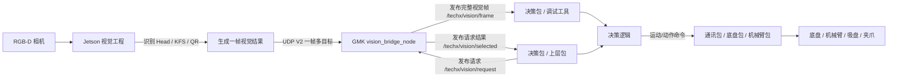

# techx_vision_bridge GMK 单节点视觉功能包使用手册

> 这份文档面向第一次接触工程的人。
>
> 目标：看完后你应该知道 **这个包是什么、接收什么数据、发布什么数据、每个字段是什么意思、如何请求某个目标、如何测试、如何配置、出问题怎么查**。

---

## 0. 最重要的结论

```text
Jetson 会实时发送它当前识别到的所有目标。
GMK 的 techx_vision_bridge 会实时接收完整视觉帧。
上层包只有向 /techx/vision/request 发送请求后，GMK 才会在 /techx/vision/selected 输出对应目标。
```

所以你要把这个包理解成：

```text
完整传感器数据入口：/techx/vision/frame
按需目标输出入口：/techx/vision/request -> /techx/vision/selected
```

一句话：

```text
Jetson 发所有数据；GMK 保存完整帧；你请求什么，GMK 就从最新完整帧中筛出什么。
```

---

## 1. 当前工程只有一个运行节点

启动命令：

```bash
ros2 launch techx_vision_bridge vision_bridge.launch.py
```

启动后只有一个节点：

```text
/vision_bridge_node
```

这个节点内部同时做 6 件事：

```text
1. 接收 Jetson UDP V2。
2. 校验 magic / version / length / CRC / seq。
3. 解码 class_id / confidence / u / v / camera_link x/y/z。
4. 根据 class_rules 映射目标类型和推荐坐标系。
5. 计算 robot_base / arm1_base / arm2_base 坐标。
6. 发布 /frame，并根据 /request 发布 /selected。
```

不需要再启动第二个 selector 节点。

---

## 2. 总数据流图

### 2.1 主流程图



### 2.2 图里每条线是什么意思

| 数据流 | 方向 | 含义 |
|---|---|---|
| UDP V2 | Jetson -> GMK | Jetson 把所有识别到的目标发给 GMK |
| `/techx/vision/frame` | GMK -> 上层 | 完整视觉帧，所有目标都在里面 |
| `/techx/vision/request` | 上层 -> GMK | 上层告诉 GMK：我现在想要哪种目标 |
| `/techx/vision/selected` | GMK -> 上层 | GMK 从最新完整帧中筛出的对应目标 |
| 动作命令 | 决策 -> 通讯/控制 | 不是本包负责，本包只给视觉数据 |

---

## 3. “Jetson 全量发送，GMK 按需输出”怎么理解

假设同一帧里 Jetson 同时看到了：

```text
拳头武器头：class_id = 100
红方 R2 真 KFS：class_id = 2
二维码：class_id = 200
```

Jetson 会在同一个 UDP V2 包里全部发送：

```text
UDP V2:
  count = 3
  target[0].class_id = 100
  target[1].class_id = 2
  target[2].class_id = 200
```

GMK 会发布完整帧：

```text
/techx/vision/frame:
  targets[0] = class_id 100
  targets[1] = class_id 2
  targets[2] = class_id 200
```

然后：

| 你发的 request | GMK selected 输出 |
|---|---|
| `class_id=100` | 拳头武器头 |
| `class_id=2` | 红方 R2 真 KFS |
| `class_id=200` | 二维码 |

注意：

```text
/request 不会让 Jetson 改模型。
/request 只是让 GMK 从最新 /frame 中筛目标。
```

---

## 4. 这个包接收什么数据

### 4.1 输入 A：Jetson UDP V2

Jetson 每次推理完成后，会发一帧 UDP V2 到 GMK。

GMK 默认监听：

```yaml
udp_bind_addr: "0.0.0.0"
udp_port: 12345
```

Jetson 端配置必须对上：

```json
"target_ip": "GMK 的 IP",
"target_port": 12345
```

### 4.2 UDP V2 数据包结构

```text
Header 17 字节
Target 0~16 个，每个 Target 27 字节
CRC16 2 字节
```

完整长度：

```text
17 + count * 27 + 2
```

#### Header 字段

| 字段 | 类型 | 含义 |
|---|---|---|
| `magic` | uint16 | 固定 `0x55AB`，表示 V2 包 |
| `version` | uint8 | 固定 `2` |
| `flags` | uint8 | 预留 |
| `seq` | uint32 | Jetson 递增帧序号 |
| `timestamp` | float64 | Jetson 时间戳 |
| `count` | uint8 | 本帧目标数量，0~16 |

#### Target 字段

| 字段 | 类型 | 含义 | 新手理解 |
|---|---|---|---|
| `track_id` | uint8 | 跟踪编号 | 同一个物体连续帧的编号 |
| `class_id` | uint8 | 全局类别编号 | 最重要，决定目标是什么 |
| `color` | uint8 | 颜色 | 0未知，1红，2蓝 |
| `confidence` | float32 | 置信度 | 越高越可信 |
| `u` | float32 | 像素中心横坐标 | 目标在图像里的 x |
| `v` | float32 | 像素中心纵坐标 | 目标在图像里的 y |
| `x` | float32 | camera_link X | 相机坐标，单位 m |
| `y` | float32 | camera_link Y | 相机坐标，单位 m |
| `z` | float32 | camera_link Z | 相机前方距离，单位 m |

### 4.3 UDP 特殊情况

| 情况 | 含义 | 怎么处理 |
|---|---|---|
| `count=0` | Jetson 在线，但当前帧没目标 | 不要控制目标，但链路不算断 |
| `z=0` | 有检测框，但深度无效 | 不能使用三维坐标控制 |
| 长时间无 UDP | Jetson/网络/GMK 链路异常 | GMK 会 warning，超过 fatal 超时会退出 |

---

## 5. 输入 B：`/techx/vision/request`

上层包想拿某个目标，就发：

```text
/techx/vision/request
```

类型：

```text
techx_vision_bridge/msg/VisionRequest
```

### 5.1 request 字段

| 字段 | 含义 | 常用值 |
|---|---|---|
| `request_seq` | 请求序号 | 每次递增，方便调试 |
| `target_type` | 目标大类 | 武器头=1，KFS=2，二维码=3 |
| `zone_id` | 区域编号 | 武器头=1，KFS=2，二维码=3 |
| `use_class_id` | 是否精确筛 class_id | 推荐 `true` |
| `class_id` | 具体目标编号 | 100拳头，2红方真KFS，200二维码 |
| `use_color` | 是否筛颜色 | 一般 `false`，因为 class_id 已区分红蓝 |
| `color` | 颜色 | 0未知，1红，2蓝 |
| `require_control_xyz` | 是否要求三维控制坐标有效 | 抓取/靠近建议 `true`，纯像素对齐可 `false` |
| `min_confidence` | 最低置信度 | 建议 0.3~0.5 |
| `max_frame_age_sec` | 允许使用多旧的视觉帧 | 建议 0.2；0 表示用默认值 |

### 5.2 没有 request 会发生什么

当前代码行为是：

```text
没有收到 /request：不会输出有意义的 /selected 目标。
收到 /request：开始按最新 frame 输出 /selected。
```

所以如果你只看 `/selected` 但没有发 request，会觉得“没有数据”。这是正常的。

---

## 6. 输出 A：`/techx/vision/frame`

这是完整视觉帧，调试时最重要。

类型：

```text
techx_vision_bridge/msg/VisionFrame
```

### 6.1 字段说明

| 字段 | 含义 | 判断方式 |
|---|---|---|
| `header` | ROS2 消息头 | 时间戳、frame_id |
| `seq` | Jetson 帧序号 | 持续变化说明 Jetson 持续发数据 |
| `protocol_version` | 协议版本 | 当前应为 2 |
| `upstream_timestamp` | Jetson 时间戳 | Jetson 产生该帧的时间 |
| `target_count` | 本帧目标数量 | 0 表示这一帧没目标 |
| `has_target` | 是否有目标 | false 不等于断联 |
| `targets[]` | 所有目标 | 每个目标是 VisionObject |

### 6.2 常见判断

| 现象 | 含义 |
|---|---|
| `/frame` 有频率，`seq` 增加 | Jetson -> GMK 联通 |
| `target_count=0` | 在线但当前无目标 |
| `/frame` 长时间没有消息 | UDP 链路、Jetson、GMK 节点可能有问题 |

---

## 7. 数据字典：`VisionObject`

`VisionObject` 是单个目标。它出现在：

```text
/frame.targets[]
/objects
/selected.target
```

### 7.1 目标身份

| 字段 | 含义 | 例子 |
|---|---|---|
| `zone_id` | 目标区域 | 1武器头，2KFS，3二维码 |
| `target_type` | 目标大类 | 1武器头，2KFS，3二维码 |
| `class_id` | 具体类别 | 100拳头，2红方真KFS，200二维码 |
| `color` | 颜色 | 0未知，1红，2蓝 |
| `confidence` | 置信度 | 太低不要控制 |

### 7.2 像素数据

| 字段 | 含义 | 用途 |
|---|---|---|
| `u` | 像素中心 x | 显示/对齐 |
| `v` | 像素中心 y | 显示/对齐 |
| `align_err_x` | 相对图像中心的横向误差 | 二维码/底盘水平对齐 |
| `align_err_y` | 相对图像中心的纵向误差 | 调试或垂直对齐 |

`align_err_x/y` 是归一化误差，不是米。

### 7.3 相机坐标：camera_link

| 字段 | 含义 | 单位 |
|---|---|---|
| `valid_xyz` | 相机三维坐标是否有效 | bool |
| `x/y/z` | 目标在相机坐标系下的位置 | m |

常见 RGB-D 相机坐标：

```text
X：图像右方
Y：图像下方
Z：相机前方
```

### 7.4 机器人坐标：robot_base

| 字段 | 含义 | 谁用 |
|---|---|---|
| `valid_robot_xyz` | robot 坐标是否有效 | 决策判断 |
| `robot_x/y/z` | 目标在机器人本体坐标下的位置 | 底盘/导航/靠近 |

底盘控制武器头、KFS、二维码靠近时，优先用：

```text
robot_x / robot_y / robot_z
```

### 7.5 机械臂1坐标：arm1_base

| 字段 | 含义 | 谁用 |
|---|---|---|
| `valid_arm1_xyz` | arm1 坐标是否有效 | 机械臂1判断 |
| `arm1_x/y/z` | 目标在机械臂1基座下的位置 | 机械臂1抓武器头 |

武器头抓取用：

```text
arm1_x / arm1_y / arm1_z
```

### 7.6 机械臂2坐标：arm2_base

| 字段 | 含义 | 谁用 |
|---|---|---|
| `valid_arm2_xyz` | arm2 坐标是否有效 | 机械臂2判断 |
| `arm2_x/y/z` | 目标在机械臂2基座下的位置 | 机械臂2操作 KFS |

KFS 操作用：

```text
arm2_x / arm2_y / arm2_z
```

### 7.7 推荐坐标：control

| 字段 | 含义 |
|---|---|
| `control_frame` | 推荐坐标系 |
| `valid_control_xyz` | 推荐坐标是否有效 |
| `control_x/y/z` | 推荐控制坐标 |

`control_frame`：

| 数值 | 坐标系 |
|---:|---|
| 1 | camera_link |
| 2 | robot_base |
| 3 | arm1_base |
| 4 | arm2_base |

推荐理解：

```text
简单用法：看 control_x/y/z。
稳妥用法：底盘明确用 robot_x/y/z，机械臂1明确用 arm1_x/y/z，机械臂2明确用 arm2_x/y/z。
```

---

## 8. 输出 B：`/techx/vision/selected`

`/selected` 是 GMK 根据 `/request` 筛出的结果。

类型：

```text
techx_vision_bridge/msg/VisionSelection
```

### 8.1 字段说明

| 字段 | 含义 |
|---|---|
| `frame_seq` | 结果来自哪一帧 `/frame` |
| `request_seq` | 对应哪一次 request |
| `has_request` | GMK 是否收到过 request |
| `has_match` | 是否找到匹配目标 |
| `status` | 当前状态 |
| `selected_index` | 目标在 `/frame.targets[]` 中的索引 |
| `frame_age_sec` | 当前使用的 frame 有多旧 |
| `score` | GMK 选择该目标的评分 |
| `target` | 选中的 VisionObject |

### 8.2 status 状态码

| status | 名称 | 含义 | 能不能控制 |
|---:|---|---|---|
| 0 | OK | 找到目标 | 还要检查坐标有效后才能控制 |
| 1 | NO_REQUEST | 没收到 request | 不能控制 |
| 2 | NO_FRAME | 还没收到视觉帧 | 不能控制 |
| 3 | NO_MATCH | 有 frame，但没有匹配目标 | 不能控制 |
| 4 | FRAME_STALE | frame 太旧 | 不能控制 |
| 5 | REQUEST_STALE | request 超时 | 不能控制 |

控制前至少检查：

```text
status == 0
has_match == true
```

如果要用三维坐标，还要检查：

```text
target.valid_control_xyz == true
```

---

## 9. 比赛 class_id 表

UDP 里不传名字，只传 `class_id`。

### 9.1 武器头

| class_id | 名称 | 中文 | target_type | 推荐主坐标 |
|---:|---|---|---:|---|
| 100 | weapon_head_fist | 拳头 | 1 | arm1_base |
| 101 | weapon_head_palm | 掌 | 1 | arm1_base |
| 102 | weapon_head_spear | 矛头 | 1 | arm1_base |

### 9.2 KFS

| class_id | 名称 | 中文 | color | target_type | 推荐主坐标 |
|---:|---|---|---:|---:|---|
| 0 | kfs_red_r1 | 红方 R1 | 1 | 2 | arm2_base |
| 1 | kfs_red_r2_fake | 红方 R2 假 | 1 | 2 | arm2_base |
| 2 | kfs_red_r2_true | 红方 R2 真 | 1 | 2 | arm2_base |
| 3 | kfs_blue_r1 | 蓝方 R1 | 2 | 2 | arm2_base |
| 4 | kfs_blue_r2_fake | 蓝方 R2 假 | 2 | 2 | arm2_base |
| 5 | kfs_blue_r2_true | 蓝方 R2 真 | 2 | 2 | arm2_base |

### 9.3 二维码

| class_id | 名称 | 中文 | target_type | 推荐主坐标 |
|---:|---|---|---:|---|
| 200 | qr_code | 二维码 | 3 | robot_base |

---

## 10. 怎么请求对应数据

### 10.1 推荐使用 demo 脚本

编译并 source 后，可以直接运行：

```bash
ros2 run techx_vision_bridge vision_request_demo.py --name qr
ros2 run techx_vision_bridge vision_request_demo.py --name head_fist
ros2 run techx_vision_bridge vision_request_demo.py --name head_palm
ros2 run techx_vision_bridge vision_request_demo.py --name head_spear
ros2 run techx_vision_bridge vision_request_demo.py --name kfs_red_r2_true
ros2 run techx_vision_bridge vision_request_demo.py --name kfs_blue_r2_true
```

### 10.2 手动发布二维码请求

```bash
ros2 topic pub --once /techx/vision/request techx_vision_bridge/msg/VisionRequest "{
  request_seq: 1,
  target_type: 3,
  zone_id: 3,
  use_class_id: true,
  class_id: 200,
  use_color: false,
  require_control_xyz: false,
  min_confidence: 0.3,
  max_frame_age_sec: 0.2
}"
```

看结果：

```bash
ros2 topic echo /techx/vision/selected
```

### 10.3 手动发布拳头武器头请求

```bash
ros2 topic pub --once /techx/vision/request techx_vision_bridge/msg/VisionRequest "{
  request_seq: 2,
  target_type: 1,
  zone_id: 1,
  use_class_id: true,
  class_id: 100,
  use_color: false,
  require_control_xyz: true,
  min_confidence: 0.4,
  max_frame_age_sec: 0.2
}"
```

### 10.4 手动发布红方 R2 真 KFS 请求

```bash
ros2 topic pub --once /techx/vision/request techx_vision_bridge/msg/VisionRequest "{
  request_seq: 3,
  target_type: 2,
  zone_id: 2,
  use_class_id: true,
  class_id: 2,
  use_color: false,
  require_control_xyz: true,
  min_confidence: 0.4,
  max_frame_age_sec: 0.2
}"
```

---

## 11. 每类目标应该用哪些坐标

| 目标 | 底盘用 | 机械臂用 | 备注 |
|---|---|---|---|
| 武器头 | `robot_x/y/z` | `arm1_x/y/z` | 先靠近，再机械臂1抓取 |
| KFS | `robot_x/y/z` | `arm2_x/y/z` | 先靠近，再机械臂2操作 |
| 二维码 | `align_err_x/y`、`robot_x/y/z` | 通常不用机械臂 | 对齐和靠近用 |

不要让下游包自己再做：

```text
camera_link -> robot_base
camera_link -> arm1_base
camera_link -> arm2_base
```

这些转换已经在本包内部统一做完。

---

## 12. 配置文件 `vision_bridge.yaml`

路径：

```text
src/techx_vision_bridge/config/vision_bridge.yaml
```

### 12.1 UDP 配置

```yaml
udp_bind_addr: "0.0.0.0"
udp_port: 12345
```

### 12.2 话题配置

```yaml
frame_topic_name: "/techx/vision/frame"
object_topic_name: "/techx/vision/objects"
request_topic_name: "/techx/vision/request"
selected_topic_name: "/techx/vision/selected"
```

### 12.3 class_rules

```yaml
class_rules:
  - "0-5:2:2:4:0.0"
  - "100-102:1:1:3:0.0"
  - "200:3:3:2:0.0"
```

格式：

```text
"class_id范围:zone_id:target_type:control_frame:priority_bias"
```

`control_frame`：

| 数值 | 坐标系 |
|---:|---|
| 1 | camera_link |
| 2 | robot_base |
| 3 | arm1_base |
| 4 | arm2_base |

### 12.4 外参配置

```yaml
enable_transforms: true
T_robot_camera_xyz_rpy: [0.0, 0.0, 0.0, 0.0, 0.0, 0.0]
T_arm1_robot_xyz_rpy:  [0.0, 0.0, 0.0, 0.0, 0.0, 0.0]
T_arm2_robot_xyz_rpy:  [0.0, 0.0, 0.0, 0.0, 0.0, 0.0]
```

单位：

```text
x/y/z：米
roll/pitch/yaw：弧度
```

方向：

```text
p_robot = T_robot_camera * p_camera
p_arm1  = T_arm1_robot  * p_robot
p_arm2  = T_arm2_robot  * p_robot
```

---

## 13. 断联保护

### 13.1 短时间无 UDP

```yaml
watchdog_timeout_sec: 0.3
```

超过这个时间没有新 UDP，会报警；如果已有 request，`/selected` 会变成 `FRAME_STALE`。

### 13.2 长时间无 UDP 自动退出

```yaml
fatal_no_udp_timeout_sec: 600.0
```

默认 600 秒，也就是 10 分钟。超过后节点主动 shutdown。

想改成 5 分钟：

```yaml
fatal_no_udp_timeout_sec: 300.0
```

想禁用：

```yaml
fatal_no_udp_timeout_sec: 0.0
```

---

## 14. 快速测试流程

### 14.1 编译

```bash
cd ~/gmk_ws
rm -rf build install log
colcon build --packages-select techx_vision_bridge
source install/setup.bash
```

### 14.2 检查配置

```bash
python3 src/techx_vision_bridge/tools/check_vision_bridge_config.py \
  --config src/techx_vision_bridge/config/vision_bridge.yaml
```

### 14.3 启动 GMK 节点

```bash
ros2 launch techx_vision_bridge vision_bridge.launch.py
```

### 14.4 模拟 Jetson

另一个终端：

```bash
ros2 run techx_vision_bridge mock_jetson_sender.py --mode mixed --ip 127.0.0.1
```

### 14.5 看完整帧

```bash
ros2 topic echo /techx/vision/frame
```

### 14.6 请求某个目标

```bash
ros2 run techx_vision_bridge vision_request_demo.py --name qr
```

或者：

```bash
ros2 run techx_vision_bridge vision_request_demo.py --name head_fist
```

---

## 15. 新手常见问题

### Q1：为什么 `/selected` 没数据？

先确认你有没有发 `/techx/vision/request`。

```text
没有 request，就不会输出对应 selected 目标。
```

### Q2：为什么 `/frame` 有数据，但 `/selected` 是 NO_MATCH？

说明 `/frame` 里有目标，但没有满足 request 条件的目标。检查：

```text
class_id 是否写对
min_confidence 是否太高
require_control_xyz 是否要求了三维坐标但目标 z=0
max_frame_age_sec 是否太小
```

### Q3：为什么目标识别到了，但坐标不能用？

看：

```text
valid_control_xyz
valid_robot_xyz
valid_arm1_xyz
valid_arm2_xyz
```

如果是 false，通常是 Jetson 深度无效或外参/配置问题。

### Q4：GMK 会不会只接收我请求的目标？

不会。GMK 会接收 Jetson 发来的所有目标。

request 只影响 `/selected` 输出，不影响 `/frame`。

### Q5：通讯包应该直接订阅视觉吗？

推荐流程是：

```text
决策包订阅视觉数据。
决策包生成动作命令。
通讯包只负责把动作命令发给下位机。
```

如果通讯包确实需要直接读取，也应优先看 `/selected`，并检查状态码。

### Q6：要不要 GMK -> Jetson ACK / heartbeat？

当前不是必须。

```text
安全控制以 GMK / 决策包是否收到新 frame 为准。
不建议每帧 ACK。
以后如果 Jetson UI 要显示 GMK 在线，可以加 0.5~1 秒一次的低频 heartbeat。
```

---

## 16. 最推荐的小白使用顺序

```text
1. 先只启动 GMK。
2. 用 mock_jetson_sender.py 模拟 Jetson。
3. echo /techx/vision/frame，看完整帧。
4. 运行 vision_request_demo.py，请求二维码/武器头/KFS。
5. echo /techx/vision/selected，看筛选结果。
6. 确认 request/selected 没问题后，再接真实 Jetson。
7. 接真实 Jetson 后，先只看数据，不控制底盘和机械臂。
8. 完成外参标定后，再做低速控制测试。
```

---

## 17. 最终记忆版

```text
Jetson：一直发所有识别目标。
GMK：一直接收并发布完整 /frame。
上层：想要什么，就发 /request。
GMK：从最新 /frame 中筛出对应目标，发 /selected。
底盘：用 robot_x/y/z。
机械臂1：用 arm1_x/y/z。
机械臂2：用 arm2_x/y/z。
调试：永远先看 /frame。
控制：永远检查 /selected.status 和 valid_control_xyz。
```
