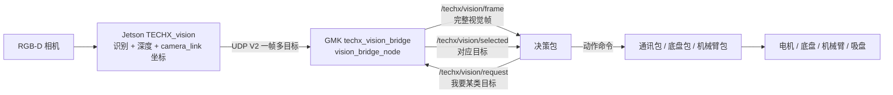
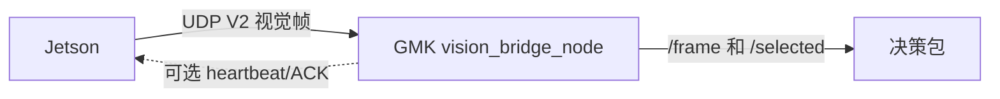

# techx_vision_bridge 使用说明（GMK 单节点视觉功能包）

这份 README 面向第一次接触工程的人。它只讲 GMK 仓库里的 `techx_vision_bridge` 包：

```text
这个包是什么？
启动后会接收什么数据？
会发布哪些数据？
其他包要发什么 request 才能拿到对应目标？
每个字段是什么意思？
怎么用 demo 跑通？
通讯断开、无目标、无深度时会发生什么？
```

---

## 0. 小白先看这 8 句话

```text
1. 这个包运行在 GMK / ROS 2 端，不运行在 Jetson 端。
2. 当前只有一个运行节点：vision_bridge_node。
3. Jetson 通过 UDP V2 持续把识别结果发给这个节点。
4. 这个节点会发布完整视觉帧：/techx/vision/frame。
5. 如果你想拿某一种目标，就给 /techx/vision/request 发请求。
6. 这个节点会把对应目标发布到 /techx/vision/selected。
7. 底盘用 robot_x/y/z，机械臂1用 arm1_x/y/z，机械臂2用 arm2_x/y/z。
8. /selected 是筛选结果，/frame 才是完整事实，调试一定要看 /frame。
```

一句话：

```text
Jetson 发所有看到的目标；GMK 这个包统一转换坐标；上层包想要什么目标，就发 request，然后读 selected。
```

---

## 1. 当前软件结构

### 1.1 只有一个节点

启动命令：

```bash
ros2 launch techx_vision_bridge vision_bridge.launch.py
```

只会启动一个节点：

```text
vision_bridge_node
```

这个节点同时做 5 件事：

```text
1. 接收 Jetson UDP V2 数据包。
2. 校验 magic / version / length / CRC / seq。
3. 解码目标 class_id / color / confidence / u / v / camera_link x/y/z。
4. 统一计算 robot_base / arm1_base / arm2_base 坐标。
5. 发布 /frame，并根据 /request 发布 /selected。
```

### 1.2 为什么不是两个节点

现在不再单独启动 `vision_selector_node`。筛选逻辑已经合并进 `vision_bridge_node`，这样新手只需要启动一个 launch，不需要理解节点之间互相订阅。

---

## 2. 图示：整个数据流

### 2.1 无回传 ACK 的当前主流程



### 2.2 每条箭头的意思

| 箭头 | 含义 |
|---|---|
| Jetson -> GMK | UDP V2，一帧多目标，含 class_id、像素中心、camera_link 坐标 |
| GMK -> 决策 `/frame` | 完整视觉帧，所有目标都在里面 |
| 决策 -> GMK `/request` | 告诉 GMK 当前想要哪类目标 |
| GMK -> 决策 `/selected` | GMK 从最新 frame 中筛出的当前对应目标 |
| 决策 -> 通讯/底盘/机械臂 | 决策包计算出的动作命令，不是本包负责 |

### 2.3 关于 GMK -> Jetson ACK/heartbeat

当前主流程没有 GMK -> Jetson 的 ACK。原因：

```text
1. UDP V2 是传感器流，Jetson 持续发，GMK持续收。
2. 真正使用视觉数据的是 GMK/决策包，所以安全状态应该在 GMK/决策包判断。
3. 每帧 ACK 会让协议复杂化，也不能保证目标语义、深度、外参一定正确。
```

是否需要新增 GMK -> Jetson heartbeat？结论：

```text
不是当前必须项，但后续可以做成可选功能。
```

适合加 heartbeat 的场景：

```text
1. Jetson UI 想显示“GMK 在线 / GMK 已收到最近数据”。
2. 比赛时希望 Jetson 发现 GMK 离线后弹警告或自动退出。
3. 双机网络不稳定，需要更明显的端到端状态提示。
```

不建议做的方式：

```text
不要每帧 ACK。
```

推荐如果后续要加：

```text
GMK 每 0.5~1.0 秒发一个 heartbeat 给 Jetson。
Jetson UI 只把它当状态显示，不要把它当控制安全唯一依据。
```

如果加入 heartbeat，数据流会变成：



---

## 3. 这个包接收哪些数据

## 3.1 输入 A：Jetson UDP V2

Jetson 每次推理完成后发一帧 UDP V2 给 GMK。GMK 默认监听：

```yaml
udp_bind_addr: "0.0.0.0"
udp_port: 12345
```

Jetson 配置中的：

```json
"target_ip": "GMK 的 IP",
"target_port": 12345
```

必须和 GMK 对上。

### UDP V2 包里有什么

Header：

| 字段 | 类型 | 含义 |
|---|---|---|
| `magic` | uint16 | 固定 `0x55AB` |
| `version` | uint8 | 当前为 `2` |
| `flags` | uint8 | 预留 |
| `seq` | uint32 | Jetson 递增帧序号 |
| `timestamp` | float64 | Jetson 时间戳 |
| `count` | uint8 | 本帧目标数量，0~16 |

每个 Target：

| 字段 | 类型 | 含义 |
|---|---|---|
| `track_id` | uint8 | 跟踪 ID |
| `class_id` | uint8 | 全局目标类别编号 |
| `color` | uint8 | 0 未知，1 红，2 蓝 |
| `confidence` | float32 | 置信度 |
| `u` | float32 | 像素中心 u |
| `v` | float32 | 像素中心 v |
| `x` | float32 | camera_link X，单位 m |
| `y` | float32 | camera_link Y，单位 m |
| `z` | float32 | camera_link Z，单位 m |

包尾：

| 字段 | 类型 | 含义 |
|---|---|---|
| `crc16` | uint16 | CRC 校验 |

重要语义：

```text
count = 0：Jetson 和 GMK 通讯在线，但这一帧没有目标。
z = 0：识别到了目标，但没有有效深度，不能直接用于三维控制。
长时间没有任何 UDP：Jetson、网络或 GMK 接收链路可能断开。
```

## 3.2 输入 B：ROS2 请求 `/techx/vision/request`

上层包想要某一个目标时，发布 `VisionRequest` 到：

```text
/techx/vision/request
```

这个 request 不会让 Jetson 改模型，也不会让 Jetson 只识别某个目标。它的含义是：

```text
请 GMK 从最新视觉帧里帮我筛出某个目标。
```

---

## 4. 这个包发布哪些数据

| 话题 | 类型 | 默认 | 用途 |
|---|---|---|---|
| `/techx/vision/frame` | `VisionFrame` | 开 | 完整视觉帧，包含所有目标，主数据源 |
| `/techx/vision/objects` | `VisionObject` | 开 | 单目标调试流 |
| `/techx/vision/selected` | `VisionSelection` | 开 | 根据 `/request` 筛出的对应目标 |
| `/techx/vision/kfs_targets` | 旧消息 | 关 | 旧兼容，不推荐 |
| `/techx/vision/targets` | 旧消息 | 关 | 旧兼容，不推荐 |

推荐用法：

```text
调试和复杂策略：订阅 /techx/vision/frame。
只想要当前阶段目标：发布 /request，订阅 /selected。
```

---

## 5. 数据字典：VisionFrame

话题：

```text
/techx/vision/frame
```

类型：

```text
techx_vision_bridge/msg/VisionFrame
```

字段：

| 字段 | 含义 | 新手怎么理解 |
|---|---|---|
| `header` | ROS2 消息头 | 时间戳和 frame_id |
| `seq` | Jetson UDP 帧序号 | 用于判断是否持续更新 |
| `protocol_version` | 协议版本 | 当前为 2 |
| `upstream_timestamp` | Jetson 时间戳 | Jetson 侧产生这帧的时间 |
| `target_count` | 目标数量 | 本帧有几个目标 |
| `has_target` | 是否有目标 | false 不代表断联，只代表这一帧没目标 |
| `targets[]` | 所有目标 | 每个元素都是 VisionObject |

最常见判断：

```text
收到 /frame 且 target_count=0：链路在线，但当前无目标。
长时间收不到 /frame：链路可能断了。
```

---

## 6. 数据字典：VisionObject

`VisionObject` 是最重要的数据结构。它出现在：

```text
/frame.targets[]
/selected.target
/objects
```

### 6.1 目标身份

| 字段 | 含义 | 用法 |
|---|---|---|
| `zone_id` | 区域编号 | 1 武器头，2 KFS，3 二维码 |
| `target_type` | 目标大类 | 1 武器头，2 KFS，3 二维码 |
| `class_id` | 具体目标编号 | 最重要，决定到底是哪一种目标 |
| `color` | 颜色 | 0 未知，1 红，2 蓝 |
| `confidence` | 置信度 | 太低不要用于控制 |

### 6.2 像素数据

| 字段 | 含义 | 用法 |
|---|---|---|
| `u` | 像素中心横坐标 | 调试显示 |
| `v` | 像素中心纵坐标 | 调试显示 |
| `align_err_x` | 相对图像中心的横向误差 | QR/目标水平对齐 |
| `align_err_y` | 相对图像中心的纵向误差 | 俯仰/高度对齐参考 |

### 6.3 相机坐标

| 字段 | 含义 | 用法 |
|---|---|---|
| `valid_xyz` | camera_link 坐标是否有效 | false 不要用 x/y/z 控制 |
| `x/y/z` | 目标在 camera_link 下的位置 | Jetson 原始 3D 点 |

### 6.4 机器人本体坐标

| 字段 | 含义 | 用法 |
|---|---|---|
| `valid_robot_xyz` | robot_base 坐标是否有效 | 底盘控制前必须 true |
| `robot_x/y/z` | 目标在 robot_base 下的位置 | 底盘靠近、导航、二维码距离 |

### 6.5 机械臂1坐标

| 字段 | 含义 | 用法 |
|---|---|---|
| `valid_arm1_xyz` | arm1_base 坐标是否有效 | 机械臂1控制前必须 true |
| `arm1_x/y/z` | 目标在 arm1_base 下的位置 | 武器头抓取/对接 |

### 6.6 机械臂2坐标

| 字段 | 含义 | 用法 |
|---|---|---|
| `valid_arm2_xyz` | arm2_base 坐标是否有效 | 机械臂2控制前必须 true |
| `arm2_x/y/z` | 目标在 arm2_base 下的位置 | KFS 操作 |

### 6.7 推荐控制坐标

| 字段 | 含义 | 用法 |
|---|---|---|
| `control_frame` | 推荐坐标系 | 2 robot，3 arm1，4 arm2 |
| `valid_control_xyz` | 推荐坐标是否有效 | false 不要用 control_x/y/z |
| `control_x/y/z` | 推荐控制坐标 | 简单控制可以直接用，但要看 control_frame |

最稳使用规则：

```text
底盘：用 robot_x/y/z。
机械臂1：用 arm1_x/y/z。
机械臂2：用 arm2_x/y/z。
简单 demo：可以用 control_x/y/z，但必须确认 control_frame。
```

---

## 7. 数据字典：VisionRequest

话题：

```text
/techx/vision/request
```

类型：

```text
techx_vision_bridge/msg/VisionRequest
```

字段：

| 字段 | 含义 | 示例 |
|---|---|---|
| `request_seq` | 请求序号 | 每次发请求可以递增 |
| `target_type` | 目标大类 | 1 武器头，2 KFS，3 二维码，0 任意 |
| `zone_id` | 区域 | 1 武器头，2 KFS，3 二维码，0 任意 |
| `use_class_id` | 是否精确筛 class_id | 通常 true |
| `class_id` | 具体目标 | 100 拳头，2 红方 R2 真，200 二维码 |
| `use_color` | 是否筛颜色 | 一般 false，KFS 可按 class_id 精确区分 |
| `color` | 颜色 | 1 红，2 蓝 |
| `require_control_xyz` | 是否必须有 3D 坐标 | 机械臂/底盘三维控制时 true |
| `min_confidence` | 最低置信度 | 0.3~0.5 常用 |
| `max_frame_age_sec` | 最老可用帧年龄 | 0.2 常用 |

---

## 8. 数据字典：VisionSelection

话题：

```text
/techx/vision/selected
```

类型：

```text
techx_vision_bridge/msg/VisionSelection
```

字段：

| 字段 | 含义 |
|---|---|
| `frame_seq` | 选中的目标来自哪一帧 |
| `request_seq` | 对应哪个 request |
| `has_request` | 是否收到过 request |
| `has_match` | 是否找到匹配目标 |
| `status` | 状态码 |
| `selected_index` | 目标在 frame.targets[] 的索引 |
| `frame_age_sec` | 使用的视觉帧有多旧 |
| `score` | 选择评分 |
| `target` | 选中的 VisionObject |

状态码：

| status | 名称 | 含义 | 能不能控制 |
|---:|---|---|---|
| 0 | OK | 找到可用目标 | 还要检查 valid 坐标 |
| 1 | NO_REQUEST | 没收到 request | 不能 |
| 2 | NO_FRAME | 没收到视觉帧 | 不能 |
| 3 | NO_MATCH | 有帧但无匹配目标 | 不能 |
| 4 | FRAME_STALE | 视觉帧太旧 | 不能 |
| 5 | REQUEST_STALE | 请求过期 | 不能 |

控制前最少检查：

```text
status == 0
has_match == true
target.valid_control_xyz == true   # 如果需要三维控制
```

---

## 9. 比赛目标 class_id 表

UDP 只传 `class_id`，不传字符串名字。Jetson、GMK、决策包必须统一这张表。

### 武器头

| class_id | 名称 | 中文 | target_type | zone_id | 推荐坐标 |
|---:|---|---|---:|---:|---|
| 100 | `weapon_head_fist` | 拳头 | 1 | 1 | arm1_base |
| 101 | `weapon_head_palm` | 掌 | 1 | 1 | arm1_base |
| 102 | `weapon_head_spear` | 矛头 | 1 | 1 | arm1_base |

### KFS

| class_id | 名称 | 中文 | color | target_type | zone_id | 推荐坐标 |
|---:|---|---|---:|---:|---:|---|
| 0 | `kfs_red_r1` | 红方 R1 KFS | 1 | 2 | 2 | arm2_base |
| 1 | `kfs_red_r2_fake` | 红方 R2 假 KFS | 1 | 2 | 2 | arm2_base |
| 2 | `kfs_red_r2_true` | 红方 R2 真 KFS | 1 | 2 | 2 | arm2_base |
| 3 | `kfs_blue_r1` | 蓝方 R1 KFS | 2 | 2 | 2 | arm2_base |
| 4 | `kfs_blue_r2_fake` | 蓝方 R2 假 KFS | 2 | 2 | 2 | arm2_base |
| 5 | `kfs_blue_r2_true` | 蓝方 R2 真 KFS | 2 | 2 | 2 | arm2_base |

### 二维码

| class_id | 名称 | 中文 | target_type | zone_id | 推荐坐标 |
|---:|---|---|---:|---:|---|
| 200 | `qr_code` | 二维码 | 3 | 3 | robot_base |

---

## 10. 快速上手 demo

### 10.1 编译

```bash
cd ~/gmk_ws
rm -rf build install log
colcon build --packages-select techx_vision_bridge
source install/setup.bash
```

### 10.2 启动 GMK 节点

终端 1：

```bash
ros2 launch techx_vision_bridge vision_bridge.launch.py
```

### 10.3 没有 Jetson 时，用 mock 假装 Jetson 发数据

终端 2：

```bash
ros2 run techx_vision_bridge mock_jetson_sender.py --mode mixed --ip 127.0.0.1
```

### 10.4 看完整视觉帧

终端 3：

```bash
ros2 topic echo /techx/vision/frame
```

应该能看到：

```text
seq
target_count
targets:
  class_id
  confidence
  robot_x/y/z
  arm1_x/y/z
  arm2_x/y/z
  control_frame
```

### 10.5 直接用 demo 请求二维码

终端 4：

```bash
ros2 run techx_vision_bridge vision_request_demo.py --name qr
```

它会循环发布 `/request`，并打印 `/selected`。

### 10.6 请求拳头武器头

```bash
ros2 run techx_vision_bridge vision_request_demo.py --name head_fist
```

### 10.7 请求掌武器头

```bash
ros2 run techx_vision_bridge vision_request_demo.py --name head_palm
```

### 10.8 请求矛头武器头

```bash
ros2 run techx_vision_bridge vision_request_demo.py --name head_spear
```

### 10.9 请求红方 R2 真 KFS

```bash
ros2 run techx_vision_bridge vision_request_demo.py --name kfs_red_r2_true
```

### 10.10 请求蓝方 R2 真 KFS

```bash
ros2 run techx_vision_bridge vision_request_demo.py --name kfs_blue_r2_true
```

### 10.11 手动发 request 示例

```bash
ros2 topic pub --once /techx/vision/request techx_vision_bridge/msg/VisionRequest "{
  request_seq: 1,
  target_type: 3,
  zone_id: 3,
  use_class_id: true,
  class_id: 200,
  use_color: false,
  require_control_xyz: false,
  min_confidence: 0.3,
  max_frame_age_sec: 0.2
}"
```

然后看：

```bash
ros2 topic echo /techx/vision/selected
```

---

## 11. 其他包应该如何拿数据

### 11.1 决策包

推荐订阅：

```text
/techx/vision/frame
```

或者使用：

```text
发布 /techx/vision/request
订阅 /techx/vision/selected
```

决策包应该负责：

```text
1. 判断当前任务阶段。
2. 决定要武器头、KFS 还是二维码。
3. 检查 status / confidence / valid_xyz / frame_age。
4. 输出底盘或机械臂命令。
```

### 11.2 通讯包

推荐正式结构：

```text
通讯包不要直接做视觉决策。
通讯包只执行决策包给出的底盘/机械臂/吸盘/夹爪命令。
```

如果临时测试，通讯包可以订阅 `/selected`，但仍然要做安全检查。

### 11.3 底盘包

底盘需要的坐标：

```text
robot_x/y/z
```

不要用 `arm1_x/y/z` 或 `arm2_x/y/z` 控底盘。

### 11.4 机械臂1

武器头用：

```text
arm1_x/y/z
```

### 11.5 机械臂2

KFS 用：

```text
arm2_x/y/z
```

---

## 12. 配置文件 vision_bridge.yaml

路径：

```text
src/techx_vision_bridge/config/vision_bridge.yaml
```

关键参数：

```yaml
udp_bind_addr: "0.0.0.0"
udp_port: 12345
frame_topic_name: "/techx/vision/frame"
request_topic_name: "/techx/vision/request"
selected_topic_name: "/techx/vision/selected"
```

class 映射：

```yaml
class_rules:
  - "0-5:2:2:4:0.0"
  - "100-102:1:1:3:0.0"
  - "200:3:3:2:0.0"
```

含义：

```text
0~5：KFS，默认 control_frame=arm2_base。
100~102：武器头，默认 control_frame=arm1_base。
200：二维码，默认 control_frame=robot_base。
```

外参：

```yaml
T_robot_camera_xyz_rpy: [x, y, z, roll, pitch, yaw]
T_arm1_robot_xyz_rpy:  [x, y, z, roll, pitch, yaw]
T_arm2_robot_xyz_rpy:  [x, y, z, roll, pitch, yaw]
```

单位：

```text
x/y/z：米
roll/pitch/yaw：弧度
```

方向：

```text
p_robot = T_robot_camera * p_camera
p_arm1  = T_arm1_robot  * p_robot
p_arm2  = T_arm2_robot  * p_robot
```

---

## 13. 断联和保护机制

配置：

```yaml
watchdog_timeout_sec: 0.3
fatal_no_udp_timeout_sec: 600.0
```

含义：

| 参数 | 含义 |
|---|---|
| `watchdog_timeout_sec` | 短时间没收到 UDP 时报警 |
| `fatal_no_udp_timeout_sec` | 长时间没收到任何有效 UDP 时自动 shutdown |

默认 600 秒是 10 分钟。改 5 分钟：

```yaml
fatal_no_udp_timeout_sec: 300.0
```

禁用自动退出：

```yaml
fatal_no_udp_timeout_sec: 0.0
```

---

## 14. ACK / heartbeat 是否需要

### 当前是否必须

不必须。当前安全闭环主要在 GMK 和决策包侧：

```text
GMK 收不到 Jetson 数据 -> /selected 变 FRAME_STALE 或节点超时退出。
决策包看到 stale/no frame -> 停止控制。
```

Jetson 即使不知道 GMK 有没有收到，也不会直接控制底盘/机械臂。

### 什么时候需要

如果你希望 Jetson UI 明确显示 GMK 是否在线，可以后续加低频 heartbeat。

推荐设计：

```text
GMK 每 0.5~1.0 秒发一个 heartbeat 给 Jetson。
Jetson UI 显示 GMK online/offline。
不做每帧 ACK。
```

现在 README 里先预留这个方向，但不把它作为当前必需协议，避免让基础链路变复杂。

---

## 15. 新手常见错误

### Q1：我发布 request 了，为什么 selected 没目标？

检查：

```text
1. /frame 有没有数据。
2. request 的 class_id 是否正确。
3. min_confidence 是否太高。
4. require_control_xyz 是否 true，但目标 z=0。
5. max_frame_age_sec 是否太小。
```

### Q2：有 /frame，但 selected 是 FRAME_STALE？

说明 latest frame 太旧。检查 Jetson 是否还在发 UDP，或把 `max_frame_age_sec` 临时调大。

### Q3：底盘靠近武器头/KFS 用哪个坐标？

用：

```text
robot_x/y/z
```

### Q4：机械臂抓武器头用哪个坐标？

用：

```text
arm1_x/y/z
```

### Q5：机械臂操作 KFS 用哪个坐标？

用：

```text
arm2_x/y/z
```

### Q6：control_x/y/z 能不能直接用？

可以，但必须看 `control_frame`。新手更推荐明确使用 `robot_x`、`arm1_x`、`arm2_x`。

---

## 16. 最推荐的新手使用流程

```text
1. colcon build 编译。
2. ros2 launch 启动 vision_bridge_node。
3. 用 mock_jetson_sender.py 模拟 Jetson。
4. echo /techx/vision/frame，看完整数据。
5. 用 vision_request_demo.py --name qr 请求二维码。
6. echo /techx/vision/selected，看筛选结果。
7. 接真实 Jetson，只看数据，不控制机构。
8. 填外参，验证 robot_x/arm1_x/arm2_x 是否正确。
9. 决策包接入。
10. 低速联调底盘和机械臂。
```

记住：

```text
/frame 是完整数据。
/request 是你想要什么目标。
/selected 是这个包帮你筛出来的目标。
```
