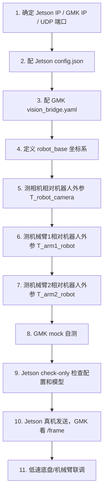
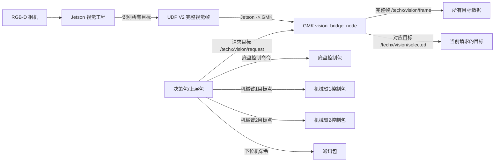
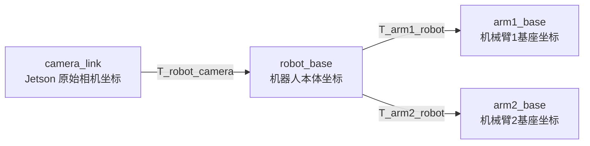

# techx_vision_bridge 说明书

这份文档只讲 **GMK 仓库里的 `techx_vision_bridge` 包怎么用**。

如果你完全没接触过这个工程，先记住一句话：

```text
Jetson 会实时发送它看到的所有目标。
GMK 这个包会实时接收完整视觉数据。
你想要哪个目标，就向 /techx/vision/request 发请求。
GMK 会把对应目标发到 /techx/vision/selected。
```

这个包不是机械臂控制包，也不是底盘控制包。它的作用是：

```text
Jetson 视觉数据  ->  GMK ROS2 话题  ->  决策/底盘/机械臂能用的坐标数据
```

---

# 目录

```text
0. 10 分钟跑通 mock 流程
1. 真实上车前要配置哪些东西
2. 整个工程的数据流
3. 本包接收什么、发布什么
4. 目标数据到底有哪些
5. 武器头、KFS、二维码分别怎么用
6. 怎么向 GMK 请求目标
7. 坐标系和外参怎么理解
8. vision_bridge.yaml 每个重要参数
9. 完整真实联调流程
10. 成功现象和失败排查
11. 常见问题
```

---

# 0.  10 分钟跑通 mock 流程

这一节不需要真实 Jetson、不需要相机、不需要机械臂。目的是先确认 **GMK 包自己能跑通**。

## 0.1 编译

```bash
cd ~/gmk_ws
rm -rf build install log
colcon build --packages-select techx_vision_bridge
source install/setup.bash
```

如果这一步失败，先不要接 Jetson，也不要接机械臂。

---

## 0.2 启动 GMK 视觉桥

```bash
ros2 launch techx_vision_bridge vision_bridge.launch.py
```

你现在只需要知道：这个命令会启动一个节点：

```text
vision_bridge_node
```

这个节点会同时做：

```text
接收 Jetson UDP
发布 /techx/vision/frame
接收 /techx/vision/request
发布 /techx/vision/selected
```

---

## 0.3 用假 Jetson 发送数据

新开一个终端：

```bash
source ~/gmk_ws/install/setup.bash
ros2 run techx_vision_bridge mock_jetson_sender.py --mode mixed --ip 127.0.0.1
```

这个脚本会模拟 Jetson 发数据给 GMK。

---

## 0.4 看完整视觉数据

新开一个终端：

```bash
source ~/gmk_ws/install/setup.bash
ros2 topic echo /techx/vision/frame
```

如果能看到 `targets[]`、`class_id`、`robot_x/y/z`、`arm1_x/y/z`、`arm2_x/y/z`，说明 GMK 收数据正常。

---

## 0.5 请求一个目标

例如请求二维码：

```bash
source ~/gmk_ws/install/setup.bash
ros2 run techx_vision_bridge vision_request_demo.py --name qr
```

请求拳头武器头：

```bash
ros2 run techx_vision_bridge vision_request_demo.py --name head_fist
```

请求红方 R2 真 KFS：

```bash
ros2 run techx_vision_bridge vision_request_demo.py --name kfs_red_r2_true
```

如果 demo 输出：

```text
status = OK
has_match = true
class_id = 你请求的目标编号
```

说明 `/request -> /selected` 流程正常。

---

# 1. 真实上车前要配置哪些东西

真实上车前，不要直接跑。先按这个顺序配置。



---

## 1.1 需要你填写的配置清单

| 类别 | 配置项 | 写在哪里 | 为什么要填 |
|---|---|---|---|
| 网络 | GMK IP | Jetson `config.json` 的 `udp.target_ip` | Jetson 要知道把数据发给谁 |
| 网络 | UDP 端口 | Jetson `config.json` 和 GMK `vision_bridge.yaml` | 两边端口必须一致 |
| 相机 | 图像宽高、内参 | Jetson `config.json` | Jetson 用它算 camera_link 坐标 |
| 模型 | KFS/武器头模型路径 | Jetson `config.json` | Jetson 要加载模型 |
| 目标编号 | `class_id_map` | Jetson `config.json` | 保证 KFS/武器头编号和 GMK 一致 |
| 机器人 | `robot_base` 坐标定义 | 机械/控制约定 | 底盘控制要统一方向 |
| 相机外参 | `T_robot_camera_xyz_rpy` | GMK `vision_bridge.yaml` | 把相机坐标转成机器人坐标 |
| 机械臂1外参 | `T_arm1_robot_xyz_rpy` | GMK `vision_bridge.yaml` | 把机器人坐标转成机械臂1坐标 |
| 机械臂2外参 | `T_arm2_robot_xyz_rpy` | GMK `vision_bridge.yaml` | 把机器人坐标转成机械臂2坐标 |

---

## 1.2 推荐网络例子

假设：

```text
Jetson IP = 192.168.10.10
GMK IP    = 192.168.10.100
UDP 端口  = 12345
```

Jetson `config.json` 里应该写：

```json
"udp": {
  "target_ip": "192.168.10.100",
  "target_port": 12345
}
```

GMK `vision_bridge.yaml` 里应该写：

```yaml
udp_bind_addr: "0.0.0.0"
udp_port: 12345
```

注意：

```text
Jetson 的 target_ip 填 GMK 的 IP。
GMK 的 udp_port 必须和 Jetson 的 target_port 一样。
```

---

# 2. 整个工程的数据流

## 2.1 总体图



---

## 2.2 最重要的理解

### Jetson 是全量发送

如果 Jetson 同一帧看到：

```text
拳头武器头 class_id = 100
红方 R2 真 KFS class_id = 2
二维码 class_id = 200
```

它会一起发送：

```text
UDP V2:
  count = 3
  target[0] = class_id 100
  target[1] = class_id 2
  target[2] = class_id 200
```

### GMK 是完整接收

GMK 会发布完整帧：

```text
/techx/vision/frame:
  targets[0] = class_id 100
  targets[1] = class_id 2
  targets[2] = class_id 200
```

### 上层包按需请求

如果上层发：

```text
/request: class_id = 100
```

GMK 的 `/selected` 输出拳头武器头。

如果上层发：

```text
/request: class_id = 2
```

GMK 的 `/selected` 输出红方 R2 真 KFS。

注意：

```text
/request 不会命令 Jetson 改模型。
/request 只影响 GMK 输出哪个 selected。
/frame 永远是完整帧。
```

---

# 3. 本包接收什么、发布什么

## 3.1 本包接收的数据

| 输入 | 类型 | 来源 | 作用 |
|---|---|---|---|
| UDP V2 | 自定义 UDP 包 | Jetson | Jetson 发来的所有识别目标 |
| `/techx/vision/request` | `VisionRequest` | 决策包/上层包 | 请求 GMK 输出某个目标 |

---

## 3.2 本包发布的数据

| 输出 | 类型 | 给谁用 | 作用 |
|---|---|---|---|
| `/techx/vision/frame` | `VisionFrame` | 决策、调试、日志 | 一帧完整视觉数据，包含所有目标 |
| `/techx/vision/objects` | `VisionObject` | 调试 | 单目标流，可不用 |
| `/techx/vision/selected` | `VisionSelection` | 决策、底盘、机械臂上层逻辑 | 根据 request 筛选出的目标 |

---

## 3.3 三个 ROS2 话题怎么选

| 你想干什么 | 看哪个话题 |
|---|---|
| 看 Jetson 到底发来了什么 | `/techx/vision/frame` |
| 想要某一个目标 | 发 `/techx/vision/request`，看 `/techx/vision/selected` |
| 调试每个目标单独输出 | `/techx/vision/objects` |

---

# 4. 目标数据到底有哪些

每一个目标在 ROS2 里叫 `VisionObject`。

它会出现在：

```text
/techx/vision/frame.targets[]
/techx/vision/objects
/techx/vision/selected.target
```

---

## 4.1 你比赛真正关心的字段

| 你想知道什么 | 字段 | 说明 |
|---|---|---|
| 这是什么物体 | `class_id` | 100拳头，2红方真KFS，200二维码等 |
| 是哪一类目标 | `target_type` | 1武器头，2KFS，3二维码 |
| 识别可信不可信 | `confidence` | 太低不要控制 |
| 底盘怎么靠近 | `robot_x/y/z` | 目标在机器人本体坐标下的位置 |
| 机械臂1怎么抓 | `arm1_x/y/z` | 目标在机械臂1基座下的位置 |
| 机械臂2怎么抓 | `arm2_x/y/z` | 目标在机械臂2基座下的位置 |
| 坐标能不能用 | `valid_robot_xyz` / `valid_arm1_xyz` / `valid_arm2_xyz` | 防止无深度或坐标无效 |
| 数据新不新 | `/selected.frame_age_sec` | 旧数据不能控制 |
| 当前能不能控制 | `/selected.status` | 必须 OK 才能继续 |

---

## 4.2 目标身份数据

| 字段 | 含义 | 例子 |
|---|---|---|
| `class_id` | 具体物体编号 | 100拳头，2红方 R2 真 KFS，200二维码 |
| `target_type` | 目标大类 | 1武器头，2KFS，3二维码 |
| `zone_id` | 区域编号 | 1武器头，2KFS，3二维码 |
| `color` | 颜色 | 0未知，1红，2蓝 |
| `confidence` | 置信度 | 0.0~1.0 |

---

## 4.3 像素数据

| 字段 | 含义 | 用途 |
|---|---|---|
| `u` | 图像中心 x 像素 | 显示、调试 |
| `v` | 图像中心 y 像素 | 显示、调试 |
| `align_err_x` | 相对图像中心横向误差 | 底盘旋转/图像居中 |
| `align_err_y` | 相对图像中心纵向误差 | 调试或垂直对齐 |

`align_err_x/y` 不是米，是归一化图像误差。

---

## 4.4 坐标数据

| 坐标 | 字段 | 谁用 | 说明 |
|---|---|---|---|
| 相机坐标 | `x/y/z` | 调试 | Jetson 原始 camera_link 坐标 |
| 机器人坐标 | `robot_x/y/z` | 底盘/导航 | 目标相对机器人本体的位置 |
| 机械臂1坐标 | `arm1_x/y/z` | 机械臂1 | 武器头操作 |
| 机械臂2坐标 | `arm2_x/y/z` | 机械臂2 | KFS 操作 |
| 推荐坐标 | `control_x/y/z` | 简单控制 | GMK 根据目标类型推荐的坐标 |

注意：正式控制建议明确使用：

```text
底盘：robot_x/y/z
机械臂1：arm1_x/y/z
机械臂2：arm2_x/y/z
```

不要所有东西都偷懒用 `control_x/y/z`。

---

# 5. 武器头、KFS、二维码分别怎么用

## 5.1 武器头

| class_id | 目标 |
|---:|---|
| 100 | 拳头武器头 |
| 101 | 掌武器头 |
| 102 | 矛头武器头 |

使用方式：

| 使用对象 | 使用字段 | 用途 |
|---|---|---|
| 底盘 | `robot_x/y/z` | 前后靠近、左右调整、转向对准 |
| 机械臂1 | `arm1_x/y/z` | 抓取、对接武器头 |

重点：

```text
武器头不是只给机械臂1。
武器头同时也输出 robot_x/y/z 给底盘。
control_x/y/z 默认推荐 arm1 坐标，但底盘不要用 control，底盘要用 robot_x/y/z。
```

---

## 5.2 KFS

| class_id | 目标 |
|---:|---|
| 0 | 红方 R1 KFS |
| 1 | 红方 R2 假 KFS |
| 2 | 红方 R2 真 KFS |
| 3 | 蓝方 R1 KFS |
| 4 | 蓝方 R2 假 KFS |
| 5 | 蓝方 R2 真 KFS |

使用方式：

| 使用对象 | 使用字段 | 用途 |
|---|---|---|
| 底盘 | `robot_x/y/z` | 前后靠近、左右调整、转向对准 |
| 机械臂2 | `arm2_x/y/z` | 操作 KFS |

重点：

```text
KFS 不是只给机械臂2。
KFS 同时也输出 robot_x/y/z 给底盘。
control_x/y/z 默认推荐 arm2 坐标，但底盘不要用 control，底盘要用 robot_x/y/z。
```

---

## 5.3 二维码

| class_id | 目标 |
|---:|---|
| 200 | 二维码 |

使用方式：

| 使用对象 | 使用字段 | 用途 |
|---|---|---|
| 底盘 | `align_err_x/y` | 图像居中、旋转对准 |
| 底盘 | `robot_x/y/z` | 靠近、距离控制 |

二维码通常不需要机械臂坐标。

---

# 6. 怎么向 GMK 请求目标

## 6.1 最简单方式：用 demo

请求二维码：

```bash
ros2 run techx_vision_bridge vision_request_demo.py --name qr
```

请求拳头武器头：

```bash
ros2 run techx_vision_bridge vision_request_demo.py --name head_fist
```

请求红方 R2 真 KFS：

```bash
ros2 run techx_vision_bridge vision_request_demo.py --name kfs_red_r2_true
```

请求蓝方 R2 真 KFS：

```bash
ros2 run techx_vision_bridge vision_request_demo.py --name kfs_blue_r2_true
```

---

## 6.2 手动发布 request

请求二维码：

```bash
ros2 topic pub --once /techx/vision/request techx_vision_bridge/msg/VisionRequest "{
  request_seq: 1,
  target_type: 3,
  zone_id: 3,
  use_class_id: true,
  class_id: 200,
  use_color: false,
  require_control_xyz: false,
  min_confidence: 0.3,
  max_frame_age_sec: 0.2
}"
```

请求拳头武器头：

```bash
ros2 topic pub --once /techx/vision/request techx_vision_bridge/msg/VisionRequest "{
  request_seq: 2,
  target_type: 1,
  zone_id: 1,
  use_class_id: true,
  class_id: 100,
  use_color: false,
  require_control_xyz: true,
  min_confidence: 0.4,
  max_frame_age_sec: 0.2
}"
```

请求红方 R2 真 KFS：

```bash
ros2 topic pub --once /techx/vision/request techx_vision_bridge/msg/VisionRequest "{
  request_seq: 3,
  target_type: 2,
  zone_id: 2,
  use_class_id: true,
  class_id: 2,
  use_color: false,
  require_control_xyz: true,
  min_confidence: 0.4,
  max_frame_age_sec: 0.2
}"
```

---

## 6.3 request 每个字段是什么意思

| 字段 | 含义 | 推荐 |
|---|---|---|
| `request_seq` | 请求编号 | 每次递增 |
| `target_type` | 目标大类 | 武器头=1，KFS=2，QR=3 |
| `zone_id` | 目标区域 | 武器头=1，KFS=2，QR=3 |
| `use_class_id` | 是否精确筛 class_id | 推荐 true |
| `class_id` | 具体目标编号 | 100/101/102/0~5/200 |
| `use_color` | 是否筛颜色 | 通常 false |
| `require_control_xyz` | 是否要求三维坐标有效 | 抓取/靠近建议 true |
| `min_confidence` | 最低置信度 | 0.3~0.5 |
| `max_frame_age_sec` | 允许使用多旧的 frame | 建议 0.2 |

---

# 7. `/selected` 怎么判断能不能用

看：

```bash
ros2 topic echo /techx/vision/selected
```

`status` 含义：

| status | 名称 | 含义 | 能否控制 |
|---:|---|---|---|
| 0 | OK | 找到目标 | 继续检查坐标有效 |
| 1 | NO_REQUEST | 没收到 request | 不能控制 |
| 2 | NO_FRAME | 没收到视觉帧 | 不能控制 |
| 3 | NO_MATCH | 有 frame，但没有匹配目标 | 不能控制 |
| 4 | FRAME_STALE | frame 太旧 | 不能控制 |
| 5 | REQUEST_STALE | request 太旧 | 不能控制 |

控制前必须检查：

```text
selected.status == 0
selected.has_match == true
selected.frame_age_sec < 0.2
selected.target.confidence >= 0.3~0.5
```

底盘控制前检查：

```text
selected.target.valid_robot_xyz == true
```

机械臂1控制前检查：

```text
selected.target.valid_arm1_xyz == true
```

机械臂2控制前检查：

```text
selected.target.valid_arm2_xyz == true
```

---

# 8. 坐标系和外参怎么理解

本工程涉及 4 个坐标系。



---

## 8.1 camera_link

Jetson 输出的相机坐标。

常见 RGB-D 坐标：

```text
X：图像右方
Y：图像下方
Z：相机前方
```

底盘和机械臂不要直接用它控制。

---

## 8.2 robot_base

机器人本体坐标系，建议定义为：

```text
X：机器人前方
Y：机器人左方
Z：机器人上方
```

底盘使用：

```text
robot_x / robot_y / robot_z
```

可以这样理解：

```text
robot_x：目标在机器人前方多少米，用于前后靠近
robot_y：目标在机器人左/右多少米，用于左右平移
atan2(robot_y, robot_x)：可作为转向角误差
align_err_x：可作为图像居中转向误差
```

---

## 8.3 arm1_base

机械臂1基座坐标系。

武器头由机械臂1操作，使用：

```text
arm1_x / arm1_y / arm1_z
```

---

## 8.4 arm2_base

机械臂2基座坐标系。

KFS 由机械臂2操作，使用：

```text
arm2_x / arm2_y / arm2_z
```

---

## 8.5 外参怎么填

GMK YAML 中有三组外参：

```yaml
enable_transforms: true
T_robot_camera_xyz_rpy: [0.0, 0.0, 0.0, 0.0, 0.0, 0.0]
T_arm1_robot_xyz_rpy:  [0.0, 0.0, 0.0, 0.0, 0.0, 0.0]
T_arm2_robot_xyz_rpy:  [0.0, 0.0, 0.0, 0.0, 0.0, 0.0]
```

格式：

```text
[x, y, z, roll, pitch, yaw]
```

单位：

```text
x/y/z：米
roll/pitch/yaw：弧度
```

方向：

```text
p_robot = T_robot_camera * p_camera
p_arm1  = T_arm1_robot  * p_robot
p_arm2  = T_arm2_robot  * p_robot
```

没标定前，`robot_x/y/z`、`arm1_x/y/z`、`arm2_x/y/z` 不能直接用于真实抓取。

---

# 9. vision_bridge.yaml 重要参数

配置文件：

```text
src/techx_vision_bridge/config/vision_bridge.yaml
```

## 9.1 UDP 参数

```yaml
udp_bind_addr: "0.0.0.0"
udp_port: 12345
```

| 参数 | 含义 |
|---|---|
| `udp_bind_addr` | GMK 监听哪个本机网口，通常先用 `0.0.0.0` |
| `udp_port` | GMK 接收 Jetson UDP 的端口，必须等于 Jetson `target_port` |

---

## 9.2 话题参数

```yaml
frame_topic_name: "/techx/vision/frame"
object_topic_name: "/techx/vision/objects"
request_topic_name: "/techx/vision/request"
selected_topic_name: "/techx/vision/selected"
```

一般不用改。

---

## 9.3 class_rules

```yaml
class_rules:
  - "0-5:2:2:4:0.0"
  - "100-102:1:1:3:0.0"
  - "200:3:3:2:0.0"
```

格式：

```text
"class_or_range:zone_id:target_type:control_frame:priority_bias"
```

`control_frame`：

| 数值 | 坐标系 |
|---:|---|
| 1 | camera_link |
| 2 | robot_base |
| 3 | arm1_base |
| 4 | arm2_base |

当前含义：

```text
0~5：KFS，默认推荐 arm2_base
100~102：武器头，默认推荐 arm1_base
200：二维码，默认推荐 robot_base
```

---

## 9.4 超时参数

```yaml
watchdog_timeout_sec: 0.3
fatal_no_udp_timeout_sec: 600.0
```

| 参数 | 含义 |
|---|---|
| `watchdog_timeout_sec` | 短时间没有 UDP，输出 warning/stale |
| `fatal_no_udp_timeout_sec` | 长时间没有 UDP，节点自动 shutdown |

如果调试断联保护，可以临时改：

```yaml
fatal_no_udp_timeout_sec: 10.0
```

---

# 10. 完整真实联调流程

## 10.1 GMK 先自测

```bash
cd ~/gmk_ws
rm -rf build install log
colcon build --packages-select techx_vision_bridge
source install/setup.bash
```

检查配置：

```bash
python3 src/techx_vision_bridge/tools/check_vision_bridge_config.py \
  --config src/techx_vision_bridge/config/vision_bridge.yaml
```

启动 GMK：

```bash
ros2 launch techx_vision_bridge vision_bridge.launch.py
```

mock 测试：

```bash
ros2 run techx_vision_bridge mock_jetson_sender.py --mode mixed --ip 127.0.0.1
```

看完整帧：

```bash
ros2 topic echo /techx/vision/frame
```

请求目标：

```bash
ros2 run techx_vision_bridge vision_request_demo.py --name qr
```

---

## 10.2 Jetson 检查

在 Jetson 仓库中：

```bash
python3 launch.py --check-only --config config.json
```

必须确认：

```text
GMK IP 正确
UDP 端口一致
KFS 模型存在
武器头模型存在
class_id_map 正确
QR class_id = 200
相机参数正确
```

---

## 10.3 真机联通

GMK：

```bash
ros2 launch techx_vision_bridge vision_bridge.launch.py
```

Jetson：

```bash
./start_jetson.sh
```

GMK 上看：

```bash
ros2 topic hz /techx/vision/frame
ros2 topic echo /techx/vision/frame
```

如果 `/frame` 有频率、`seq` 递增，说明 Jetson -> GMK 联通。

---

## 10.4 低速控制验证

不要一开始就抓取。顺序：

```text
1. 只看 /frame，不控制。
2. 看 robot_x/y/z 方向是否正确。
3. 底盘低速靠近目标。
4. 看 arm1_x/y/z 或 arm2_x/y/z 是否合理。
5. 机械臂空动作验证。
6. 再做真实抓取/对接。
```

---

# 11. 成功现象和失败排查

| 现象 | 说明 | 处理 |
|---|---|---|
| `/frame` 有频率，`seq` 增加 | Jetson -> GMK 联通 | 正常 |
| `/frame` 有频率但 `target_count=0` | 链路在线，但当前没识别到目标 | 检查目标、光照、模型 |
| `/frame` 完全没有 | GMK 没收到 Jetson | 检查 IP、端口、防火墙、Jetson 是否启动 |
| `/selected.status=1` | 没收到 request | 发布 `/request` |
| `/selected.status=2` | 没收到 frame | 检查 Jetson -> GMK |
| `/selected.status=3` | 没有匹配目标 | 检查 class_id、目标是否存在 |
| `/selected.status=4` | frame 太旧 | 检查 Jetson 是否断流或卡顿 |
| `valid_robot_xyz=false` | 机器人坐标不可用 | 检查深度和 T_robot_camera |
| `valid_arm1_xyz=false` | 机械臂1坐标不可用 | 检查外参和深度 |
| `valid_arm2_xyz=false` | 机械臂2坐标不可用 | 检查外参和深度 |
| 坐标方向反了 | 外参或坐标轴定义错 | 重新检查 robot_base / camera_link 方向 |
| 机械臂抓偏 | 外参、TCP、机械臂零点误差 | 重新标定 |

---

# 12. 常见问题

## Q1：Jetson 会不会只发我请求的目标？

不会。

```text
Jetson 永远全量发送当前识别到的所有目标。
/request 只影响 GMK 的 /selected 输出。
```

---

## Q2：武器头是不是只给机械臂1？

不是。

```text
武器头同时输出 robot_x/y/z 和 arm1_x/y/z。
底盘用 robot_x/y/z。
机械臂1用 arm1_x/y/z。
```

---

## Q3：KFS 是不是只给机械臂2？

不是。

```text
KFS 同时输出 robot_x/y/z 和 arm2_x/y/z。
底盘用 robot_x/y/z。
机械臂2用 arm2_x/y/z。
```

---

## Q4：底盘应该用 control_x/y/z 吗？

不建议。

```text
底盘始终用 robot_x/y/z。
control_x/y/z 只是推荐坐标，武器头默认是 arm1，KFS 默认是 arm2。
```

---

## Q5：外参没有填能不能跑？

能跑 mock 和话题，但不能真实控制。

```text
没填 T_robot_camera，robot_x/y/z 不可信。
没填 T_arm1_robot，arm1_x/y/z 不可信。
没填 T_arm2_robot，arm2_x/y/z 不可信。
```

---

## Q6：二维码字符串会传过来吗？

当前不会。当前只传二维码中心和坐标，`class_id=200`。

---

# 13. 最后记住这 8 句话

```text
1. Jetson 全量发送所有目标。
2. GMK 完整接收并发布 /techx/vision/frame。
3. 上层想要目标，就发 /techx/vision/request。
4. GMK 把对应目标发到 /techx/vision/selected。
5. 武器头：底盘用 robot_x/y/z，机械臂1用 arm1_x/y/z。
6. KFS：底盘用 robot_x/y/z，机械臂2用 arm2_x/y/z。
7. 二维码：底盘用 robot_x/y/z 和 align_err_x/y。
8. 控制前必须检查 status、has_match、valid_*_xyz、confidence、frame_age_sec。
```
